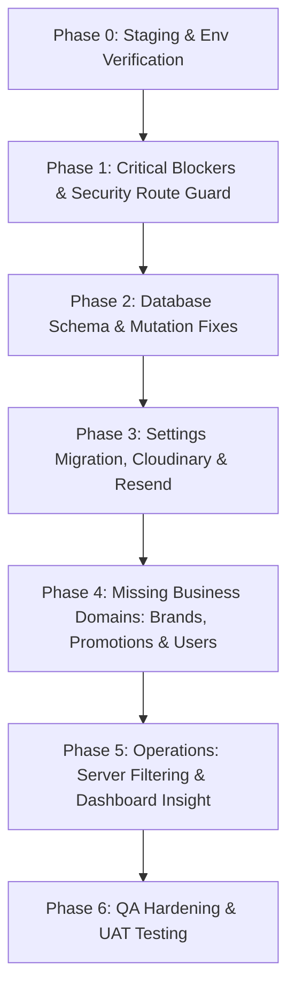

# KẾ HOẠCH FIX TOÀN DIỆN HỆ THỐNG / MASTER FIX PLAN & ROADMAP
## Dự án: Showroom Nội Thất Phương Đông (Bilingual Corporate Showroom CMS)

---

## 1. EXECUTIVE SUMMARY (TÓM TẮT ĐẦU VÀO)

Dự án Showroom Nội Thất Phương Đông đã hoàn thành giai đoạn xây dựng giao diện tĩnh (Mock-up UI) và đã triển khai hạ tầng cơ sở (Supabase Local Stack, Docker Compose) thành công. File cấu hình môi trường `.env` cũng đã được Owner cập nhật các thông số kết nối thực tế. 

Mục tiêu chính hiện tại là **chuyển đổi hệ thống từ chế độ dữ liệu giả lập (Mock Data) sang vận hành động thực tế (Real Database & API Integration)**. Để đảm bảo quá trình tích hợp không phá vỡ các tính năng hiện tại và giữ được cấu trúc chuẩn hóa song ngữ (VI/EN) cùng mô hình phân quyền **Role Model Option A**, tài liệu này tổng hợp 3 báo cáo audit (Consistency Audit V1, V2 và Infrastructure Audit) thành một **Master Fix Plan** duy nhất.

Kế hoạch này tập trung xử lý:
1. **Lỗ hổng bảo mật & Build Docker**: Khắc phục ngay file middleware bị đặt sai tên và cấu hình standalone build cho Next.js để không bị crash khi đóng gói Docker.
2. **Khắc phục lỗi ghi dữ liệu (Mutations)**: Xử lý triệt để việc các hàm thêm/sửa Sản phẩm, Danh mục, Showroom, Blog bỏ qua lưu hình ảnh (media) vào database.
3. **Chuyển đổi lưu trữ cấu hình bảo mật**: Di chuyển các cấu hình hệ thống và API keys nhạy cảm từ `localStorage` của client xuống bảng `site_settings` và `integration_secrets` trong DB, mã hóa khóa API bằng thuật toán AES-GCM-256 trên server.
4. **Bổ sung các thực thể bị thiếu**: Chuẩn hóa thực thể Thương hiệu (Brand) và chương trình Khuyến mãi (Promotion/Combo) ở cả tầng DB, API và giao diện quản trị.
5. **Tối ưu hóa hiệu năng**: Chuyển đổi bộ lọc catalog từ lọc Javascript phía client (tải 1000 bản ghi) sang thực thi SQL/RPC phía server.

---

## 2. NORMALIZED BACKLOG (DANH MỤC LỖI & YÊU CẦU CHUẨN HÓA)

Dưới đây là backlog tổng hợp, chuẩn hóa và gộp trùng từ cả 3 tài liệu audit.

| ID | Finding / Yêu cầu sửa đổi | Nguồn audit | Nhóm phân loại | Severity | Còn phải làm không? | Ghi chú |
|:---|:---|:---|:---|:---:|:---:|:---|
| **F01** | Xác minh và bảo mật Route Guard chạy qua `proxy.ts` (Next 16). | Infra Audit, Audit V1, V2 | `SECURITY_FIX_REQUIRED`, `CODE_FIX_REQUIRED` | **Critical** | Có | Sử dụng cơ chế Route Guard qua `proxy.ts` của Next.js 16.2.6 (Turbopack) thay cho `middleware.ts`. |
| **F02** | Thêm cấu hình `output: "standalone"` vào file `next.config.ts`. | Infra Audit | `CODE_FIX_REQUIRED` | **Critical** | Có | Lỗi thiếu thư mục `.next/standalone` gây crash tiến trình build Docker Production. |
| **F03** | Khắc phục lỗi SQL ghi nhận lỗi gửi thư: sửa `error_detail` thành `last_error` trong bảng `quote_notifications`. | Audit V1, V2 | `CODE_FIX_REQUIRED`, `API_REQUIRED` | **High** | Có | Xử lý lỗi sập API `/api/contact` khi Resend gặp sự cố gửi thư. |
| **F04** | Fix mutation Products: lưu liên kết hình ảnh chính và gallery vào bảng `product_media`. | Audit V1, V2 | `CODE_FIX_REQUIRED`, `DB_CHANGE_REQUIRED` | **High** | Có | Hàm mutation hiện tại đang bỏ qua tham số ảnh làm sản phẩm mới bị hiển thị ảnh rỗng. |
| **F05** | Fix mutation Categories: lưu liên kết ảnh đại diện danh mục vào `product_categories.image_media_id`. | Audit V1, V2 | `CODE_FIX_REQUIRED` | **High** | Có | Danh mục tạo mới không lưu giữ được hình ảnh đại diện. |
| **F06** | Fix mutation Showrooms: lưu liên kết ảnh đại diện showroom vào bảng `showroom_media`. | Audit V1, V2 | `CODE_FIX_REQUIRED` | **High** | Có | Form tạo showroom gửi ảnh thành công nhưng DB không ghi nhận mối quan hệ. |
| **F07** | Fix mutation Blogs: lưu liên kết ảnh bìa vào `blog_posts.cover_media_id`. Fix `getAdminBlogPostByIdOrSlug` trả về ảnh bìa. | Audit V1, V2 | `CODE_FIX_REQUIRED` | **High** | Có | Ảnh bìa blog bị bỏ qua trong mutation và bị mock trả về chuỗi rỗng khi truy vấn sửa bài. |
| **F08** | Di chuyển Settings từ `localStorage` xuống DB `site_settings` & `integration_secrets` (Mã hóa AES-GCM-256). | Audit V1, V2, Infra | `SECURITY_FIX_REQUIRED`, `CODE_FIX_REQUIRED`, `API_REQUIRED` | **High** | Có | Lưu API keys ở localStorage client gây rò rỉ bảo mật nghiêm trọng. |
| **F09** | Tích hợp Google Gemini API thật qua `/api/admin/ai/generate-draft` (Xóa bỏ mock client). | Audit V1, V2, Infra | `CODE_FIX_REQUIRED`, `API_REQUIRED` | **High** | Có | Trợ lý AI đang dùng `setTimeout` và trả về text tĩnh giả lập. |
| **F10** | Đồng bộ hóa trang quản trị thành viên `/admin/users` với bảng `profiles` của DB (Xóa bỏ tài khoản hard-code). | Audit V1, V2 | `CODE_FIX_REQUIRED`, `API_REQUIRED` | **Medium** | Có | DataTable đang hiển thị 2 tài khoản tĩnh viết cứng trong code. |
| **F11** | Chuẩn hóa domain Promotions: Thêm cấu hình combo trong DB (metadata_jsonb), xóa combo hard-code và viết quản trị. | Audit V1, V2 | `CODE_FIX_REQUIRED`, `DB_CHANGE_REQUIRED`, `BUSINESS_MODEL_UPGRADE` | **High** | Có | Trang khuyến mãi public đang dùng dữ liệu combo tĩnh, DB thiếu trường và admin chưa có quản trị. |
| **F12** | Chuẩn hóa thực thể Thương hiệu (Brand): Tạo bảng `brands` & `brand_translations`, liên kết sản phẩm qua `brand_id`. | Audit V2 | `DB_CHANGE_REQUIRED`, `API_REQUIRED`, `CODE_FIX_REQUIRED`, `BUSINESS_MODEL_UPGRADE` | **High** | Có | DB hoàn toàn trống thông tin Brand, sản phẩm đang dùng text tự do dễ gõ sai. |
| **F13** | Tối ưu hóa bộ lọc sản phẩm Catalog: Chuyển đổi từ lọc Javascript client-side sang Server-side SQL/RPC. | Audit V1, V2 | `CODE_FIX_REQUIRED`, `API_REQUIRED` | **Medium** | Có | Client đang tải 1000 sản phẩm rồi tự lọc bằng Javascript, gây lag khi dữ liệu lớn. |
| **F14** | Đồng bộ hóa dữ liệu Mega Menu và showroom availability từ database (Thay thế `lib/showroom-data.ts`). | Audit V2 | `CODE_FIX_REQUIRED` | **Medium** | Có | Các menu thả xuống và bộ lọc trạng thái trưng bày showroom vẫn đang đọc từ dữ liệu mock tĩnh. |
| **F15** | Triển khai luồng ký số trực tiếp để tải ảnh an toàn lên Cloudinary (Cloudinary Signed Uploads). | Audit V1, V2, Infra | `CODE_FIX_REQUIRED`, `API_REQUIRED` | **High** | Có | Cần API sinh chữ ký số trên server để client upload ảnh trực tiếp lên Cloudinary. |
| **F16** | Đồng bộ cấu hình Resend gửi mail báo giá và tùy biến mẫu HTML thông báo sang admin. | Audit V1, V2, Infra | `CODE_FIX_REQUIRED` | **Medium** | Có | Đã có API route nhưng cần chạy key thật và sửa template gửi email. |
| **F17** | Phân công sales phụ trách lead, lưu trữ giá trị báo giá lịch sử và ghi chú tư vấn vào `quote_requests`. | Audit V2 | `DB_CHANGE_REQUIRED`, `CODE_FIX_REQUIRED`, `BUSINESS_MODEL_UPGRADE` | **Medium** | Có | Leads khách hàng thiếu ghi chú sales và bị lệch giá nếu sau này sản phẩm đổi giá. |
| **F18** | Tối ưu bảo mật VPS: Đóng các cổng Supabase CLI (`54321`, `54322`) ra ngoài Internet, bật Basic Auth cho Studio. | Infra Audit | `SECURITY_FIX_REQUIRED` | **Critical** | Có | Ngăn chặn tin tặc brute-force mật khẩu DB mặc định của Supabase CLI. |

---

## 3. EXCLUDED / VERIFY-ONLY ITEMS (HẠNG MỤC LOẠI TRỪ / CHỈ CẦN XÁC MINH)

Theo bối cảnh hạ tầng VPS đã được triển khai xong và file `.env` đã cấu hình các biến môi trường thật, các hạng mục sau trong báo cáo hạ tầng sẽ **không cần code lại từ đầu** mà được cấu hình thành nhiệm vụ kiểm chứng (Verification Tasks) hoặc giao cho DevOps vận hành.

| Hạng mục | Thuộc audit nào | Trạng thái đề xuất | Vì sao |
| :--- | :--- | :--- | :--- |
| **Cài đặt Supabase Stack** | Infra Audit | `DONE_ASSUMED` | Docker Compose chạy dịch vụ Supabase (db, auth, kong, postgrest) đã được triển khai sẵn trên máy chủ VPS. |
| **Cập nhật các API keys trong `.env`** | Infra Audit | `DONE_ASSUMED` | Chủ dự án đã cập nhật đầy đủ các khóa môi trường thật của Cloudinary, Resend, Gemini vào `.env`. |
| **Thiết lập mạng nội bộ Docker** | Infra Audit | `VERIFY_ONLY` | Chỉ cần xác minh Next.js giao tiếp được với container Supabase Kong nội bộ qua bí danh mạng hoặc qua host mạng. |
| **Bảo mật cổng Supabase Studio (`54323`)** | Infra Audit | `VERIFY_ONLY` | Đây là nhiệm vụ cấu hình Reverse Proxy (Caddyfile/Nginx) để đặt Basic Auth bảo mật, không can thiệp vào code của Next.js app. |
| **Thiết lập Cron Job Dump Database** | Infra Audit | `VERIFY_ONLY` | Tác vụ DevOps độc lập trên hệ điều hành VPS để backup dữ liệu Postgres hàng ngày, không nằm trong code Next.js. |

---

## 4. MASTER BACKLOG THEO DOMAIN (BẢN ĐỒ CHI TIẾT TỪNG MIỀN)

Bảng phân hoạch dưới đây gom nhóm toàn bộ các task cần thực hiện theo các domain nghiệp vụ kỹ thuật của dự án để dev tiện theo dõi phạm vi ảnh hưởng.

| Domain | Vấn đề hiện tại | Cần sửa FE | Cần sửa BE/API | Cần sửa DB | Cần verify infra/config | Priority |
| :--- | :--- | :---: | :---: | :---: | :---: | :---: |
| **1. Public website** | Mega Menu đọc dữ liệu tĩnh; Logo hard-code tĩnh; Footer & Newsletter mock. | Có | Có | Có | Không | **P1** |
| **2. Product** | Lọc thuộc tính tĩnh; Mutations admin lỗi mất liên kết hình ảnh; Ràng buộc giá min/max chưa có. | Có | Có | Có | Không | **P0** |
| **3. Category** | Giao diện quản lý phẳng (thiếu Tree-view); Nguy cơ lặp đệ quy cha-con làm sập app; Mất ảnh category. | Có | Có | Có | Không | **P1** |
| **4. Brand** | Chưa tồn tại trong Database (dùng text tự do). Mega menu và filter bị hard-code. | Có | Có | Có | Không | **P0** |
| **5. Promotion** | Đang hard-code tĩnh trang public. Chưa có màn hình admin. DB thiếu trường combo. | Có | Có | Có | Không | **P1** |
| **6. Blog / Content** | Mutations lưu bài viết bị lỗi mất ảnh bìa; TOC được tự sinh bằng JS client; Thiếu tags bài viết. | Có | Có | Có | Không | **P1** |
| **7. Showroom** | Mutations mất ảnh bìa showroom. Thiếu liên kết trưng bày thực tế với sản phẩm. | Có | Có | Có | Không | **P1** |
| **8. Quote / Contact** | Lỗi tên cột SQL `error_detail` gây sập API; Thiếu phân công sales, ghi chú và giá snapshot lịch sử. | Có | Có | Có | Không | **P0** |
| **9. Admin dashboard** | Biểu đồ thống kê số lượng lead đang là mock tĩnh phía client. | Có | Có | Không | Không | **P2** |
| **10. Admin users** | Danh sách user quản trị đang bị hard-code 2 tài khoản tĩnh. | Có | Có | Không | Không | **P1** |
| **11. Admin settings** | Cài đặt hệ thống đang đọc/ghi qua localStorage phía trình duyệt, lộ API keys clear-text. | Có | Có | Có | Không | **P0** |
| **12. AI assistant** | Trợ lý AI Gemini hoàn toàn là mock UI bằng `setTimeout`. | Có | Có | Không | Không | **P1** |
| **13. Media / Upload** | Chưa tích hợp Cloudinary Signed Uploads để lưu ảnh an toàn. | Có | Có | Không | Không | **P0** |
| **14. Database / schema** | Thiếu bảng `brands`, `promotion_targets` và các cột phụ cho combo, quote audit trail. | Không | Không | Có | Có | **P0** |
| **15. Security / guard** | Xác minh và bảo mật Route Guard chạy qua `proxy.ts` (Next 16). | Không | Có | Không | Có | **P0** |
| **16. Performance** | Bộ lọc sản phẩm catalog chạy client-side, tải 1000 items từ DB về. | Có | Có | Không | Không | **P1** |

---

## 5. MASTER IMPLEMENTATION PHASES (LỘ TRÌNH TRIỂN KHAI)

Roadmap được chia làm 7 Phase dựa trên tính phụ thuộc kỹ thuật (Technical Dependency): An toàn định tuyến & đóng gói Docker làm trước -> Schema DB và Mutation làm tiếp -> API cấu hình an toàn & Upload -> Các Module nghiệp vụ bị thiếu -> Tối ưu hóa vận hành -> Kiểm chứng & QA.



### Phase 0: Verification after Deploy (Kiểm chứng hạ tầng & Env)
*   **Mục tiêu**: Đảm bảo các container chạy ổn định và các biến môi trường thật trong `.env` được Next.js và Supabase nạp chính xác trước khi sửa code.
*   **Tại sao phase này đứng trước**: Tránh việc debug code sai hướng do lỗi kết nối mạng Docker hoặc sai key dịch vụ.
*   **Danh sách task**:
    *   Chạy test kết nối từ Next.js tới Supabase Kong bằng route `/api/health`.
    *   Xác minh các key Cloudinary, Resend, Gemini có độ dài hợp lệ.
*   **Deliverables**: Log chạy `/api/health` trả về trạng thái `"ok"`.
*   **Dependencies**: VPS docker stack đã khởi chạy hoàn chỉnh.
*   **Risk nếu bỏ qua**: Tốn nhiều thời gian debug lỗi API bên thứ ba do cấu hình sai key mà không biết.

### Phase 1: Critical Blockers & Security (Khóa định tuyến & Fix đóng gói)
*   **Mục tiêu**: Khóa chặt các đường dẫn admin bị hở và đảm bảo dự án có thể build Docker Production thành công.
*   **Tại sao phase này đứng trước**: Đây là các lỗi chặn (blockers) trực tiếp quá trình kiểm thử sản xuất. Route Guard phải chạy trước khi đồng bộ dữ liệu thật.
*   **Danh sách task**:
    *   Xác minh và hoàn thiện Route Guard trong `proxy.ts` (Next 16) khớp với Next.js App Router.
    *   Thêm `output: "standalone"` vào file `next.config.ts`.
    *   Xây dựng thử nghiệm Docker image sản xuất local để xác nhận build thành công.
*   **Deliverables**: File `proxy.ts` hoạt động kiểm tra session/role thật; Docker build thành công.
*   **Dependencies**: Phase 0.
*   **Risk nếu bỏ qua**: Lộ toàn bộ trang quản trị `/admin` ra internet nếu tắt mock data; Không thể deploy bản vá lên VPS Docker.

### Phase 2: Schema & Mutation Fixes (Đồng bộ ghi dữ liệu cốt lõi)
*   **Mục tiêu**: Sửa lỗi mất hình ảnh khi admin tạo mới nội dung và fix lỗi SQL sập API liên hệ.
*   **Tại sao phase này đứng trước**: Đảm bảo các luồng ghi cơ bản (CRUD) của Sản phẩm, Danh mục, Showroom, Blog hoạt động trọn vẹn trước khi chuyển sang cấu hình phức tạp.
*   **Danh sách task**:
    *   Sửa cột `error_detail` thành `last_error` trong `app/api/contact/route.ts` dòng 127.
    *   Cập nhật các mutations `createAdminProduct`, `updateAdminProduct` để ghi mảng ảnh chính/gallery vào bảng `product_media`.
    *   Cập nhật mutations category, showroom, blog để ghi đúng ID ảnh vào các cột khóa ngoại.
*   **Deliverables**: Sửa đổi thành công file `mutations.ts` và API contact; Ảnh hiển thị đầy đủ trên chi tiết sản phẩm/bài viết mới tạo.
*   **Dependencies**: Phase 1.
*   **Risk nếu bỏ qua**: Dữ liệu trên site bị hỏng/trống ảnh đại diện; lead báo giá bị mất nếu Resend lỗi.

### Phase 3: Settings, Secrets & Real Integrations (Bảo mật cài đặt & Upload)
*   **Mục tiêu**: Loại bỏ hoàn toàn `localStorage`, chuyển API key nhạy cảm xuống DB mã hóa AES-GCM-256; tích hợp upload Cloudinary thật và email Resend thật.
*   **Tại sao phase này đứng trước**: Xây dựng nền tảng an toàn cho việc tải ảnh (ở Phase 2 mới chỉ lưu ID ảnh, giờ mới có luồng upload lấy ID thật) và chuẩn bị API key cho Gemini AI.
*   **Danh sách task**:
    *   Viết helper mã hóa/giải mã API keys bằng khóa đối xứng `AI_SECRET_ENCRYPTION_KEY`.
    *   Tạo API route `/api/admin/settings` (GET/PUT) đọc/ghi DB bảo mật. Thay thế localStorage ở Admin Settings.
    *   Viết API `/api/admin/cloudinary-sign` sinh chữ ký số và kết nối form tải ảnh.
    *   Đồng bộ hóa các trang public để đọc trực tiếp config thương hiệu/SEO từ bảng `site_settings`.
*   **Deliverables**: Trang Admin Settings tương tác với DB; Các API keys được mã hóa trong bảng `integration_secrets`; Form upload ảnh tải trực tiếp lên Cloudinary.
*   **Dependencies**: Phase 2.
*   **Risk nếu bỏ qua**: Khóa API bị lộ ra client-side; cấu hình admin không thể đồng bộ sang người dùng public.

### Phase 4: Missing Business Domains (Bổ sung Brands, Promotions & Users)
*   **Mục tiêu**: Cài đặt các bảng dữ liệu mới cho Thương hiệu, nâng cấp Khuyến mãi dạng Combo, đồng bộ quản trị nhân viên.
*   **Tại sao phase này đứng trước**: Cần có thực thể thương hiệu động để loại bỏ thuộc tính text ở sản phẩm và Mega menu.
*   **Danh sách task**:
    *   Chạy migration tạo bảng `brands` & `brand_translations`. Cập nhật bảng `products` thêm cột `brand_id`.
    *   Tạo bảng `promotion_targets`, thêm cột combo (`metadata_jsonb`, `combo_price`) vào bảng `promotions`.
    *   Viết API/Server Actions và xây dựng các trang Admin CRUD cho Brands và Promotions.
    *   Kết nối trang `/admin/users` với bảng `profiles` của DB, viết API tạo tài khoản nhân viên.
    *   Refactor Mega menu và bộ lọc catalog hiển thị thương hiệu/danh mục từ DB.
*   **Deliverables**: Các bảng dữ liệu mới được ánh xạ đầy đủ; Admin quản lý được Brand/Combo; Mega Menu tự động cập nhật khi thêm danh mục/brand mới.
*   **Dependencies**: Phase 3.
*   **Risk nếu bỏ qua**: Thông tin Combo khuyến mãi bị đóng cứng không thể chỉnh sửa; Lỗi nhập liệu do gõ tay tên thương hiệu ở sản phẩm.

### Phase 5: Operations & Optimizations (Tối ưu hóa bộ lọc & Báo cáo)
*   **Mục tiêu**: Chuyển bộ lọc Catalog sang thực thi server-side; kết nối biểu đồ dashboard thật; bổ sung các tính năng phụ vụ vận hành như phân công sales, xuất Excel.
*   **Tại sao phase này đứng trước**: Giúp ứng dụng đạt hiệu năng tối ưu và sẵn sàng cho quản trị viên vận hành kinh doanh hàng ngày.
*   **Danh sách task**:
    *   Cấu hình Next.js Server Component gọi RPC `public_products` của Supabase để lọc và phân trang sản phẩm trực tiếp từ DB.
    *   Viết câu lệnh SQL thống kê lượt báo giá theo ngày để vẽ biểu đồ Dashboard Insight thật.
    *   Thêm cột phân công sales và ghi chú tư vấn vào `quote_requests`. Tích hợp nút xuất Excel báo giá trong admin.
*   **Deliverables**: Tốc độ tải Catalog nhanh dưới 200ms; Biểu đồ Dashboard cập nhật động; Sales ghi nhận được tiến độ chăm sóc leads.
*   **Dependencies**: Phase 4.
*   **Risk nếu bỏ qua**: Ứng dụng bị chậm (lag) khi số lượng sản phẩm tăng lên; Admin không có công cụ theo dõi hiệu quả chuyển đổi leads.

### Phase 6: Polish & QA (Kiểm thử thực địa & Bàn giao)
*   **Mục tiêu**: Tích hợp trợ lý AI Gemini thật; chạy kiểm thử hồi quy tự động và tối ưu hóa Docker.
*   **Danh sách task**:
    *   Tích hợp SDK Gemini vào `/api/admin/ai/generate-draft` để hỗ trợ dịch thuật tự động song ngữ.
    *   Tắt biến `NEXT_PUBLIC_USE_MOCK_DATA=false`.
    *   Chạy bộ test kiểm thử hồi quy: `pnpm lint`, `pnpm typecheck`, `pnpm test`, `pnpm build`.
    *   Chạy Browser MCP QA xác minh toàn bộ các luồng admin/editor và quyền hạn Role Model A.
*   **Deliverables**: Trợ lý AI dịch thuật hoạt động thật; Hệ thống chạy 100% dữ liệu DB thật; Không còn bất kỳ lỗi TypeScript hay cảnh báo bảo mật nào.
*   **Dependencies**: Phase 5.
*   **Risk nếu bỏ qua**: Trợ lý AI bị lỗi khi gọi key thật; các lỗi tiềm ẩn phát sinh do thiếu kiểm thử hồi quy trên môi trường thật.

---

## 6. DETAILED TASK BREAKDOWN (PHÂN RÃ TÁC VỤ CHI TIẾT)

Dưới đây là thiết kế chi tiết từng tác vụ trọng yếu để lập trình viên/AI có thể thực thi ngay.

### Task 1: Refactor `proxy.ts` as Route Guard (Next.js 16.2.6 Turbopack)
*   **Type**: Security
*   **Severity**: Critical
*   **Source**: Infra Audit / Audit V1, V2
*   **Problem**: Đảm bảo toàn bộ logic kiểm tra quyền Admin/Editor ở tầng routing Next.js được thực thi chính xác.
*   **Root cause**: Next.js 16.2.6 sử dụng Turbopack đã chuyển đổi cơ chế Route Guard từ `middleware.ts` sang file `proxy.ts` (export hàm `proxy`), tệp `middleware.ts` cũ đã được loại bỏ. Do đó, logic kiểm duyệt định tuyến phải được cài đặt trong `proxy.ts`.
*   **Files likely impacted**: [proxy.ts](file:///d:/THCode/AI/furniture-website/proxy.ts)
*   **DB changes required**: Không.
*   **API changes required**: Không.
*   **UI changes required**: Không.
*   **Acceptance criteria**:
    1. Xác minh file `proxy.ts` xuất hàm `proxy` hoạt động như một Route Guard chính xác.
    2. Khi truy cập `/admin/products` mà chưa đăng nhập, hệ thống phải tự động redirect về trang `/admin/login`.
    3. Khi đăng nhập bằng tài khoản Editor, nếu cố gắng vào `/admin/quotes` hoặc `/admin/settings`, hệ thống phải redirect về `/admin/access-denied`.
*   **Regression risks**: Có thể gây lỗi vòng lặp redirect (Infinite Redirect Loop) nếu cấu hình đường dẫn loại trừ (matcher) không chính xác.
*   **Test cases**: 
    *   `GET /admin/products` -> Expected status 307 (redirect to login).
    *   `GET /admin/quotes` (Editor role) -> Expected status 307 (redirect to access-denied).
*   **Dependency before doing**: Không.
*   **Output expected after done**: File `proxy.ts` hoạt động chuẩn, bảo vệ tất cả các tuyến admin thực tế.

---

### Task 2: Fix mutation media for Products / Categories / Showrooms / Blogs
*   **Type**: Bugfix / Integration
*   **Severity**: High
*   **Source**: Audit V1, Audit V2
*   **Problem**: Các ảnh bìa và gallery tải lên từ admin biến mất khi lưu xuống DB, sản phẩm/bài viết mới tạo luôn bị hiển thị ảnh rỗng (placeholder).
*   **Root cause**: File `lib/supabase/mutations.ts` khi thực hiện `createAdminProduct`, `updateAdminProduct`... đã hoàn toàn bỏ qua việc thực hiện câu lệnh chèn mối quan hệ media vào bảng liên kết `product_media`, `showroom_media` hay cập nhật cột `cover_media_id` tương ứng.
*   **Files likely impacted**: 
    *   [lib/supabase/mutations.ts](file:///d:/THCode/AI/furniture-website/lib/supabase/mutations.ts)
    *   [components/showroom/admin-workflows.tsx](file:///d:/THCode/AI/furniture-website/components/showroom/admin-workflows.tsx)
*   **DB changes required**: Không (các bảng trung gian đã có sẵn cấu trúc trong DB).
*   **API changes required**: Cập nhật Server Actions tạo/sửa để nhận thêm tham số ảnh và thực hiện chèn dữ liệu.
*   **UI changes required**: Đảm bảo form gửi đúng cấu trúc ID ảnh bìa (`cover_image_id`) và mảng ID ảnh gallery (`gallery_image_ids`) lên Server Actions thay vì chỉ gửi URL tĩnh.
*   **Acceptance criteria**:
    1. Tạo mới sản phẩm với 1 ảnh bìa và 2 ảnh gallery. Sau khi lưu, truy cập DB bảng `product_media` phải thấy đúng 3 bản ghi liên kết ID.
    2. Hiệu chỉnh sản phẩm, xóa 1 ảnh gallery cũ và thêm 1 ảnh mới, DB phải cập nhật đúng số lượng và thứ tự.
    3. Tương tự cho Categories, Showrooms, và Blog Posts phải cập nhật đúng cột liên kết media.
*   **Regression risks**: Xung đột khóa ngoại nếu ID ảnh gửi lên không tồn tại trong bảng `media_assets`.
*   **Test cases**: Tạo mới một sản phẩm qua admin và mở xem chi tiết ở trang public -> Phải hiển thị đúng ảnh thật vừa tải.
*   **Dependency before doing**: Phải có dữ liệu ảnh mẫu trong `media_assets` để test.
*   **Output expected after done**: Các hàm mutations lưu hình ảnh chính xác vào DB.

---

### Task 3: Fix API contact column error (`error_detail` -> `last_error`)
*   **Type**: Bugfix / Database Consistency
*   **Severity**: High
*   **Source**: Audit V1, Audit V2
*   **Problem**: API gửi liên hệ bị sập (Internal Server Error) khi Resend gặp lỗi gửi email, dẫn đến việc mất thông tin yêu cầu báo giá của khách hàng.
*   **Root cause**: Tại file `app/api/contact/route.ts` dòng 127, code cố gắng cập nhật trạng thái lỗi gửi email thông báo vào cột tên `error_detail` trong bảng `quote_notifications`. Tuy nhiên cột thực tế trong DB được đặt tên là `last_error`.
*   **Files likely impacted**: 
    *   [app/api/contact/route.ts](file:///d:/THCode/AI/furniture-website/app/api/contact/route.ts#L127)
*   **DB changes required**: Không.
*   **API changes required**: Sửa tên trường cập nhật từ `error_detail` thành `last_error` trong API handler.
*   **UI changes required**: Không.
*   **Acceptance criteria**:
    1. Khi gửi một liên hệ mới, nếu cấu hình email sai (resend lỗi), API contact vẫn phải trả về thành công (`submitted: true`), ghi nhận lead vào bảng `quote_requests` và lưu vết lỗi gửi thư vào cột `last_error` của bảng `quote_notifications` mà không bị crash API.
*   **Regression risks**: Không có.
*   **Test cases**: Mock lỗi Resend API và gửi liên hệ -> Kiểm tra DB bảng `quote_notifications` xem lỗi có ghi vào cột `last_error` thành công.
*   **Dependency before doing**: Không.
*   **Output expected after done**: API contact hoạt động ổn định bất kể email gửi thành công hay thất bại.

---

### Task 4: Replace localStorage at Settings with server-side API + DB + secrets flow
*   **Type**: Refactor / Security
*   **Severity**: High
*   **Source**: Audit V1, Audit V2
*   **Problem**: Các khóa API bên thứ ba (Resend, Gemini) đang lưu dưới dạng văn bản rõ (clear-text) trong `localStorage` trình duyệt của người dùng, dễ bị đánh cắp qua tấn công XSS. Các cấu hình thương hiệu cũng bị cô lập ở từng máy người dùng, không đồng bộ sang người dùng public.
*   **Root cause**: Form cấu hình trong `admin-workflows.tsx` đọc/ghi trực tiếp vào key `"pd-cms-settings"` trên client-side thay vì tương tác với server DB.
*   **Files likely impacted**: 
    *   [components/showroom/admin-workflows.tsx](file:///d:/THCode/AI/furniture-website/components/showroom/admin-workflows.tsx) (SettingsPanel)
    *   Tạo mới [app/api/admin/settings/route.ts](file:///d:/THCode/AI/furniture-website/app/api/admin/settings/route.ts)
    *   [lib/supabase/server.ts](file:///d:/THCode/AI/furniture-website/lib/supabase/server.ts) (Viết helper giải mã/mã hóa)
*   **DB changes required**: Sử dụng bảng `site_settings`, `site_setting_translations` và `integration_secrets` đã có sẵn.
*   **API changes required**: 
    *   `GET /api/admin/settings`: Lấy cấu hình site và trả về API keys đã bị làm mờ (Masked API keys: `****5678`).
    *   `PUT /api/admin/settings`: Cập nhật cấu hình site, thực hiện mã hóa API keys nhạy cảm bằng AES-GCM-256 trước khi lưu vào bảng `integration_secrets`.
*   **UI changes required**: Chuyển đổi Form Settings trong Admin sang gọi API thay vì đọc ghi qua localStorage.
*   **Acceptance criteria**:
    1. Nhập Resend API Key mới vào admin và bấm Lưu. DB bảng `integration_secrets` phải hiển thị chuỗi mã hóa dài dạng Hex/Base64, cột `masked_hint` lưu đúng 4 số cuối.
    2. Khi F5 lại trang Settings, ô nhập API Key chỉ hiển thị dạng gợi ý làm mờ `****5678`.
    3. Trang chủ public đọc logo và số điện thoại liên hệ trực tiếp từ database thông qua hàm truy vấn động.
*   **Regression risks**: Nếu làm mất khóa môi trường `AI_SECRET_ENCRYPTION_KEY`, hệ thống sẽ không thể giải mã các API keys cũ đã lưu.
*   **Test cases**: Kiểm tra tab Network của devtools xem API keys gửi lên có bị lộ ra các truy vấn GET công khai hay không.
*   **Dependency before doing**: Khai báo biến `AI_SECRET_ENCRYPTION_KEY` dài đúng 32 ký tự trong `.env`.
*   **Output expected after done**: Loại bỏ hoàn toàn localStorage ở Settings; Tách biệt dữ liệu cấu hình nhạy cảm.

---

### Task 5: Integrate real Google Gemini AI assistant (remove mock)
*   **Type**: Integration / Feature
*   **Severity**: High
*   **Source**: Audit V1, Audit V2, Infra Audit
*   **Problem**: Chức năng trợ lý AI hoàn toàn là giả lập tĩnh, không thể tạo được nội dung nháp thật.
*   **Root cause**: Frontend đang dùng `setTimeout` và trả về kết quả giả lập cố định ở client. Chưa viết route handler gọi SDK Gemini thật ở server.
*   **Files likely impacted**:
    *   Tạo mới [app/api/admin/ai/generate-draft/route.ts](file:///d:/THCode/AI/furniture-website/app/api/admin/ai/generate-draft/route.ts)
    *   [components/showroom/admin-workflows.tsx](file:///d:/THCode/AI/furniture-website/components/showroom/admin-workflows.tsx) (AI Assistant Panel)
*   **DB changes required**: Không.
*   **API changes required**: Viết API `/api/admin/ai/generate-draft` nhận yêu cầu tạo nháp, thực hiện giải mã khóa `GEMINI_API_KEY` từ bảng `integration_secrets`, gọi Google Gemini API SDK để tạo bản nháp và lưu lịch sử vào `ai_drafts` để audit.
*   **UI changes required**: Thay thế nút Gọi giả lập bằng nút gọi API thật, hiển thị vòng xoay đang xử lý (loading spinner) và nạp kết quả đề xuất trả về từ Gemini vào trình soạn thảo.
*   **Acceptance criteria**:
    1. Khi admin nhập đoạn văn mô tả sản phẩm bằng tiếng Việt và bấm "AI dịch sang tiếng Anh", kết quả trả về phải là bản dịch chuẩn xác từ Gemini.
    2. Tạo nháp SEO tiêu đề/mô tả phải trả về đúng cấu trúc từ khóa sản phẩm.
    3. Lịch sử tạo nháp phải được ghi nhận vào bảng `ai_drafts` với đúng user ID thực hiện.
*   **Regression risks**: API bị treo nếu key Gemini hết hạn hoặc bị rate limit từ Google AI Studio. Cần bắt lỗi timeout và trả về thông báo thân thiện.
*   **Test cases**: Đăng nhập admin, mở AI Assistant, chọn tác vụ "Dịch thuật" với text "Nội thất gỗ óc chó cao cấp" -> Expected nhận về bản dịch có chứa cụm từ "Walnut wood furniture".
*   **Dependency before doing**: Hoàn thành Task 4 để có cơ chế lấy API key giải mã từ database.
*   **Output expected after done**: Trợ lý AI hoạt động thật bằng trí tuệ nhân tạo.

---

### Task 6: Admin users dynamic fetch (remove hardcoded list)
*   **Type**: Refactor / Security
*   **Severity**: Medium
*   **Source**: Audit V1, Audit V2
*   **Problem**: Trang quản trị tài khoản CMS hiển thị danh sách nhân viên giả lập tĩnh, không phản ánh đúng dữ liệu tài khoản thật trong cơ sở dữ liệu.
*   **Root cause**: DataTable trong `admin-pages.tsx` đang đọc cứng mảng `mockAccounts` ở client-side.
*   **Files likely impacted**:
    *   [components/showroom/admin-pages.tsx](file:///d:/THCode/AI/furniture-website/components/showroom/admin-pages.tsx) (UsersPage)
    *   Tạo Server Action hoặc API đọc dữ liệu bảng `profiles`.
*   **DB changes required**: Không (bảng `profiles` liên kết auth.users đã được định nghĩa).
*   **API changes required**: Viết API/Server Action kiểm tra quyền Admin, sau đó SELECT danh sách tài khoản từ bảng `profiles`.
*   **UI changes required**: Kết nối danh sách của DataTable với state nạp từ API/Action.
*   **Acceptance criteria**:
    1. DataTable hiển thị đúng danh sách nhân viên lấy từ bảng `profiles` trong DB (gồm email, vai trò admin/editor, trạng thái hoạt động).
    2. Admin có thể trực tiếp bấm đổi trạng thái hoạt động (`is_active: true/false`) của một nhân viên, DB phải cập nhật ngay lập tức.
*   **Regression risks**: Cần ngăn chặn việc Admin tự khóa tài khoản của chính mình (self-lockout).
*   **Test cases**: Đăng nhập bằng tài khoản Admin, vào mục Users -> Phải thấy email tài khoản admin hiện tại đang đăng nhập hiển thị trong danh sách.
*   **Dependency before doing**: Xác định tài khoản test đã có trong bảng `profiles`.
*   **Output expected after done**: Quản trị tài khoản nhân viên CMS thời gian thực qua DB.

---

### Task 7: Admin promotions dynamic CRUD & combo details (remove hardcoded promotions)
*   **Type**: Feature / Database Migration
*   **Severity**: High
*   **Source**: Audit V1, Audit V2
*   **Problem**: Trang khuyến mãi công cộng hiển thị combo tĩnh không thể sửa đổi, DB thiếu các thông số kỹ thuật hiển thị combo và chưa có trang quản lý khuyến mãi trong admin.
*   **Root cause**: Bảng `promotions` thiếu các cột phục vụ cấu hình combo; chưa code CRUD trong admin; trang public `promotions/page.tsx` dùng mảng tĩnh `promoCombos`.
*   **Files likely impacted**:
    *   [app/[locale]/promotions/page.tsx](file:///d:/THCode/AI/furniture-website/app/[locale]/promotions/page.tsx)
    *   [components/showroom/admin-workflows.tsx](file:///d:/THCode/AI/furniture-website/components/showroom/admin-workflows.tsx) (Thêm Promotions CRUD form)
    *   [lib/supabase/queries.ts](file:///d:/THCode/AI/furniture-website/lib/supabase/queries.ts) (getPromotions)
*   **DB changes required**:
    *   Chạy migration bổ sung vào bảng `promotions` các cột: `cover_media_id` (UUID references `media_assets`), `combo_price` (numeric), `original_price` (numeric), và `metadata_jsonb` (JSONB để cấu hình danh sách sản phẩm đi kèm).
    *   Tạo bảng trung gian `promotion_targets` (`id`, `promotion_id`, `target_type` ['product'/'category'/'brand'], `target_id`) để gán chiết khấu cho nhóm sản phẩm/category linh hoạt.
*   **API changes required**: Xây dựng API/Server Actions tạo/sửa/xóa chương trình khuyến mãi. Cập nhật hàm truy vấn `getPromotions` để trả về đầy đủ các cột mới.
*   **UI changes required**: 
    *   Xây dựng màn hình quản lý Promotions trong Admin (Danh sách và form tạo mới).
    *   Refactor trang `promotions/page.tsx` để gọi hàm `getPromotions` lấy dữ liệu động từ DB.
*   **Acceptance criteria**:
    1. Admin có thể tạo một chương trình khuyến mãi dạng combo với tiêu đề, giá combo, ảnh bìa và danh sách sản phẩm đi kèm.
    2. Sau khi lưu, trang khuyến mãi public phải hiển thị đúng combo vừa tạo song ngữ, thay thế hoàn toàn dữ liệu tĩnh.
*   **Regression risks**: Lỗi tính toán giá trị khuyến mãi nếu giá gốc nhỏ hơn hoặc bằng giá combo.
*   **Test cases**: Tạo khuyến mãi combo trong admin và kiểm tra xem ở trang public có hiển thị đúng ảnh và giá khuyến mãi không.
*   **Dependency before doing**: Hoàn thành Task 2 (Mutations media) để có thể tải ảnh bìa combo lên.
*   **Output expected after done**: Module khuyến mãi và combo hoạt động động hoàn toàn.

---

### Task 8: Brands dynamic domain, CRUD and product relation (remove text brand)
*   **Type**: Feature / Database Migration
*   **Severity**: High
*   **Source**: Audit V2
*   **Problem**: Hệ thống thiếu thực thể Thương hiệu (Brand) trong DB. Cột hãng ở sản phẩm đang nhập text tự do, dễ sai tả và Mega menu bị hard-code danh sách hãng.
*   **Root cause**: Báo cáo thiết kế DB ban đầu bỏ sót thực thể Thương hiệu.
*   **Files likely impacted**:
    *   [lib/supabase/mutations.ts](file:///d:/THCode/AI/furniture-website/lib/supabase/mutations.ts)
    *   [components/showroom/admin-workflows.tsx](file:///d:/THCode/AI/furniture-website/components/showroom/admin-workflows.tsx) (Thêm Brand CRUD form)
    *   [components/showroom/public-shell.tsx](file:///d:/THCode/AI/furniture-website/components/showroom/public-shell.tsx) (Mega menu)
*   **DB changes required**:
    *   Tạo bảng `brands` (`id`, `logo_media_id` references `media_assets`, `origin` text, `status` text, `sort_order` int, `created_at`, `updated_at`).
    *   Tạo bảng dịch thuật `brand_translations` (`id`, `brand_id` references `brands`, `locale`, `name`, `description`).
    *   Cập nhật bảng `products` thêm cột `brand_id` references `brands.id`. Di chuyển dữ liệu cũ từ `brand_series` sang bảng mới.
*   **API changes required**: Xây dựng API/Server Actions CRUD cho thương hiệu. Cập nhật các hàm query sản phẩm để tự động join lấy thông tin thương hiệu.
*   **UI changes required**: 
    *   Xây dựng màn hình danh sách và Form thêm/sửa Thương hiệu trong Admin.
    *   Tại form thêm/sửa sản phẩm, thay thế ô nhập text "Hãng sản xuất" bằng ô chọn Dropdown tải từ danh sách thương hiệu DB.
*   **Acceptance criteria**:
    1. Admin có thể quản trị danh sách thương hiệu đối tác (thêm logo hãng, xuất xứ).
    2. Khi tạo sản phẩm mới, bắt buộc phải chọn thương hiệu từ danh sách.
    3. Bộ lọc Catalog và Mega menu hiển thị đầy đủ các thương hiệu lấy động từ DB.
*   **Regression risks**: Lỗi khóa ngoại khi xóa một thương hiệu đang có sản phẩm liên kết. Cần cấu hình ràng buộc `ON DELETE RESTRICT` để ngăn cản việc này.
*   **Test cases**: Tạo thương hiệu "Kohler" -> Gán sản phẩm "Vòi sen tắm Kohler" -> Kiểm tra trang Catalog xem bộ lọc thương hiệu có hiển thị "Kohler" và lọc đúng sản phẩm đó không.
*   **Dependency before doing**: Đã chạy migrations tạo bảng và cập nhật cột sản phẩm thành công.
*   **Output expected after done**: Thương hiệu được chuẩn hóa thành thực thể quản trị độc lập.

---

### Task 9: Server-side product catalog filtering optimization
*   **Type**: Refactor / Performance
*   **Severity**: Medium
*   **Source**: Audit V1, Audit V2
*   **Problem**: Bộ lọc sản phẩm Catalog chạy rất chậm và tốn băng thông do tải 1000 sản phẩm từ DB về client rồi mới lọc bằng Javascript.
*   **Root cause**: Client component trong `products/page.tsx` fetch toàn bộ dữ liệu thô và tự xử lý phân trang/lọc.
*   **Files likely impacted**:
    *   [app/[locale]/products/page.tsx](file:///d:/THCode/AI/furniture-website/app/[locale]/products/page.tsx)
    *   [components/showroom/product-filter-panel.tsx](file:///d:/THCode/AI/furniture-website/components/showroom/product-filter-panel.tsx)
*   **DB changes required**: Sử dụng RPC `public_products` của Supabase đã viết sẵn (hoặc viết thêm nếu cần tối ưu).
*   **API changes required**: Cập nhật hàm query `getProducts` để nhận thêm các tham số bộ lọc (`category`, `brand`, `material`, `color`, `price_min`, `price_max`, `limit`, `offset`) và chuyển tiếp vào RPC SQL để lọc trực tiếp trên PostgreSQL.
*   **UI changes required**: Chuyển đổi bộ lọc Catalog sang cập nhật trực tiếp URL query parameters (`?category=voi-sen&brand=kohler`), Next.js Server Component sẽ tự động re-fetch dữ liệu lọc mới từ server.
*   **Acceptance criteria**:
    1. Khi bấm chọn bộ lọc danh mục và thương hiệu, trang sản phẩm reload cực nhanh, URL thay đổi tương ứng.
    2. Phân trang hoạt động đúng (ví dụ: bấm trang 2 chỉ fetch 12 sản phẩm tiếp theo từ DB, không fetch toàn bộ 1000 sản phẩm).
*   **Regression risks**: Có thể gây lệch layout hoặc mất trạng thái cuộn trang (scroll position) của người dùng khi re-fetch. Cần tối ưu bằng transitions.
*   **Test cases**: Bật log truy vấn SQL ở Supabase để xác minh câu lệnh SELECT có chứa đúng mệnh đề `WHERE category_id = ...` và `LIMIT 12 OFFSET 12` khi phân trang.
*   **Dependency before doing**: Hoàn thành Task 8 (Thương hiệu chuẩn hóa) để có thể lọc theo ID brand thật.
*   **Output expected after done**: Bộ lọc sản phẩm hoạt động nhanh, chuẩn hóa phân trang ở phía server.

---

### Task 10: Dynamic Mega-menu and filters from DB (remove `lib/showroom-data.ts` references)
*   **Type**: Refactor / Code Cleanup
*   **Severity**: Medium
*   **Source**: Audit V2
*   **Problem**: Mega-menu trên thanh điều hướng chính và bộ lọc taxonomy (như chất liệu, tông màu, phong cách) đang sử dụng mảng dữ liệu mock cứng, không cập nhật khi Admin thêm mới danh mục hoặc thương hiệu.
*   **Root cause**: Component `public-shell.tsx` và `product-filter-panel.tsx` import trực tiếp từ file mock `lib/showroom-data.ts`.
*   **Files likely impacted**:
    *   [components/showroom/public-shell.tsx](file:///d:/THCode/AI/furniture-website/components/showroom/public-shell.tsx)
    *   [components/showroom/product-filter-panel.tsx](file:///d:/THCode/AI/furniture-website/components/showroom/product-filter-panel.tsx)
*   **DB changes required**: Không.
*   **API changes required**: Đảm bảo các hàm RSC reads lấy danh mục (`getCategories`) và thương hiệu (`getBrands`) hoạt động tốt ở môi trường Server Component.
*   **UI changes required**: Thay thế các biến `brandCatalog`, `productGroups` trong code Mega-menu bằng dữ liệu nạp động từ DB.
*   **Acceptance criteria**:
    1. Thêm một danh mục sản phẩm mới tên là "Thiết bị nhà bếp" trong admin. Khi quay lại trang chủ public, Mega-menu phải hiển thị danh mục mới này song ngữ.
    2. Bộ lọc dropdown ở Catalog sản phẩm phải tự động cập nhật các tùy chọn thương hiệu và danh mục động theo DB.
*   **Regression risks**: Mega menu có thể bị vỡ layout nếu số lượng danh mục con quá nhiều. Cần giới hạn hiển thị tối đa hoặc phân cột hợp lý.
*   **Test cases**: Quét giao diện Mega Menu sau khi thêm danh mục mẫu -> Phải hiển thị đúng danh mục mẫu.
*   **Dependency before doing**: Hoàn thành Task 8 (Brands) và sửa mutations lưu category.
*   **Output expected after done**: Dữ liệu điều hướng chính hoàn toàn tự động lấy từ cơ sở dữ liệu.

---

### Task 11: Sync public config from `site_settings`
*   **Type**: Refactor / Integration
*   **Severity**: Medium
*   **Source**: Audit V1, Audit V2
*   **Problem**: Logo thương hiệu, số điện thoại hotline chân trang và các thẻ SEO meta mặc định đang viết cứng tĩnh bằng code, admin cấu hình ở cài đặt không có tác dụng.
*   **Root cause**: Thiếu kết nối giữa cấu hình của trang chủ public và bảng DB `site_settings`.
*   **Files likely impacted**:
    *   [components/showroom/public-shell.tsx](file:///d:/THCode/AI/furniture-website/components/showroom/public-shell.tsx)
    *   [app/[locale]/layout.tsx](file:///d:/THCode/AI/furniture-website/app/[locale]/layout.tsx) (Cấu hình SEO mặc định)
*   **DB changes required**: Không.
*   **API changes required**: Viết hàm query `getSiteSettings` lấy bản ghi cấu hình duy nhất từ bảng `site_settings` join với bảng dịch thuật `site_settings_translations` và lấy URL logo từ `media_assets`.
*   **UI changes required**: Đọc Hotline, Email, Địa chỉ, Logo và Title/Description SEO từ props nạp động từ hàm query trên.
*   **Acceptance criteria**:
    1. Khi Admin đổi số điện thoại hotline ở trang cài đặt từ `1900-0000` thành `1900-8888`, hotline hiển thị ở đầu trang và chân trang public phải đổi theo ngay lập tức.
    2. Thẻ tiêu đề trang chủ hiển thị đúng cấu hình SEO mặc định từ DB.
*   **Regression risks**: Nếu bảng `site_settings` chưa được khởi tạo bản ghi mặc định nào (rỗng), hệ thống có thể bị crash. Phải viết cơ chế mock fallback an toàn nếu DB trống.
*   **Test cases**: Xóa bản ghi site_settings -> Kiểm tra xem site có dùng dữ liệu fallback tĩnh an toàn không -> Nạp lại cấu hình thật -> Kiểm tra xem site có đổi Hotline thật không.
*   **Dependency before doing**: Hoàn thành Task 4 (Settings API).
*   **Output expected after done**: Toàn bộ trang public đồng bộ thông tin nhận diện thương hiệu động từ DB.

---

### Task 12: Signed upload / media flow with Cloudinary
*   **Type**: Integration / Security
*   **Severity**: High
*   **Source**: Audit V1, Audit V2, Infra Audit
*   **Problem**: Dự án chưa có luồng tải ảnh thật. Editor không thể tải ảnh sản phẩm lên server lưu trữ CDN Cloudinary một cách an toàn.
*   **Root cause**: Thiếu API sinh chữ ký số (Upload Signature) bảo mật từ server-side của Next.js trước khi gửi lên Cloudinary.
*   **Files likely impacted**:
    *   Tạo mới [app/api/admin/cloudinary-sign/route.ts](file:///d:/THCode/AI/furniture-website/app/api/admin/cloudinary-sign/route.ts)
    *   [components/showroom/admin-workflows.tsx](file:///d:/THCode/AI/furniture-website/components/showroom/admin-workflows.tsx) (Tích hợp dropzone upload)
*   **DB changes required**: Không.
*   **API changes required**:
    *   Viết API `POST /api/admin/cloudinary-sign` kiểm tra quyền đăng nhập, sinh chữ ký số (Signature) hợp lệ dựa trên `CLOUDINARY_API_SECRET` và folder đích cấu hình.
    *   Sau khi client tự gửi ảnh lên Cloudinary thành công, viết API ghi thông tin ảnh vừa upload (Public URL, size, width, height) vào bảng `media_assets` của Supabase DB để trả về ID ảnh cho form.
*   **UI changes required**: Kết nối thành phần Dropzone kéo thả ảnh trong form biên tập để thực hiện: Gọi API ký số -> Gửi file trực tiếp lên Cloudinary -> Nhận URL -> Gọi API ghi DB -> Nhận ID ảnh -> Gán ID ảnh vào form.
*   **Acceptance criteria**:
    1. Kéo một ảnh `.jpg` vào Dropzone sản phẩm, quá trình tải lên hiển thị thanh phần trăm (progress bar) và hoàn thành thành công.
    2. Ảnh tải lên hiển thị khung preview nhỏ ngay trong form.
    3. Kiểm tra tài khoản Cloudinary thấy ảnh xuất hiện trong thư mục `phuongdong_showroom`. Bảng `media_assets` ghi nhận đúng dung lượng và đường dẫn CDN của ảnh.
*   **Regression risks**: Lỗi CORS từ Cloudinary nếu domain gửi lên không khớp. Lỗi tải file dung lượng quá lớn làm nghẽn băng thông. Cần cấu hình giới hạn kích thước file tải lên (tối đa 5MB cho ảnh).
*   **Test cases**: Thử tải một tệp tin không phải ảnh (ví dụ `.pdf` hoặc `.zip`) -> Hệ thống phải chặn và báo lỗi file không hợp lệ.
*   **Dependency before doing**: Owner đã cấu hình các biến môi trường Cloudinary thật.
*   **Output expected after done**: Luồng tải ảnh động an toàn và tối ưu hoàn thành.

---

### Task 13: Verification task for deployed infrastructure (standalone output, docker build)
*   **Type**: Migration / DevOps Verification
*   **Severity**: High
*   **Source**: Infra Audit
*   **Problem**: Cần kiểm chứng hệ thống chạy ổn định sau khi đóng gói Docker mà không phát sinh lỗi crash build.
*   **Root cause**: Đây là tác vụ xác minh chất lượng đầu ra sau khi vá các lỗi F01 và F02.
*   **Files likely impacted**: 
    *   [Dockerfile](file:///d:/THCode/AI/furniture-website/Dockerfile)
    *   [docker-compose.yml](file:///d:/THCode/AI/furniture-website/docker-compose.yml)
*   **DB changes required**: Không.
*   **API changes required**: Không.
*   **UI changes required**: Không.
*   **Acceptance criteria**:
    1. Thực hiện đóng gói Docker image production local thành công bằng lệnh: `docker build -t furniture-app-prod .`.
    2. Chạy container bằng lệnh: `docker compose up app -d`.
    3. Gửi lệnh curl đến `http://localhost:3000/api/health` trả về kết quả JSON trạng thái `"ok"`.
*   **Regression risks**: Nếu build local thành công nhưng VPS bị thiếu RAM, container Next.js có thể bị tắt đột ngột (OOM Killed). Cần theo dõi tài nguyên VPS.
*   **Test cases**: Chạy container app và kiểm tra logs bằng `docker compose logs app` -> Không thấy bất kỳ lỗi khởi tạo node server nào.
*   **Dependency before doing**: Hoàn thành Task 1.
*   **Output expected after done**: Docker image đóng gói mượt mà, sẵn sàng cập nhật bản vá lên VPS sản xuất.

---

## 7. CRITICAL PATH (ĐƯỜNG THĂNG TRẦM - CÁC LIÊN KẾT CHẶN)

Đây là các điểm thắt nút (bottlenecks) trong kế hoạch. Nếu các tác vụ này bị chậm trễ hoặc bị lỗi, toàn bộ các tác vụ phía sau sẽ bị đóng băng.

| Task / Hạng mục | Chặn cái gì tiếp theo | Vì sao critical | Có thể workaround không? |
| :--- | :--- | :--- | :--- |
| **Task 1: Đổi tên middleware** | Tất cả các kiểm thử bảo mật RLS và phân quyền admin thật. | Không có middleware, hệ thống Next.js hoàn toàn hở mọi route admin và Action server, không thể tắt Mock data chạy thật. | **Không thể**. Bắt buộc phải đổi tên file chuẩn Next.js. |
| **Task 4: Di chuyển settings xuống DB** | Tích hợp AI Gemini (Task 5) và gửi Resend thật. | Bảng `integration_secrets` và API settings là nơi cung cấp các khóa API được giải mã để gọi các dịch vụ này từ server-side. | **Có thể** đọc tạm từ biến `.env`, nhưng vi phạm yêu cầu quản trị động từ admin. |
| **Task 8: Chuẩn hóa Brands trong DB** | Sửa mutations sản phẩm, Mega menu động và bộ lọc Catalog. | Thiếu bảng `brands`, sản phẩm không có ID liên kết và không thể hiển thị dropdown chọn hãng trong Admin. | **Có thể** giữ cột text như cũ, nhưng gây nhập liệu sai lệch và hỏng bộ lọc. |
| **Task 12: Signed upload Cloudinary** | Thao tác nhập liệu content thật của Editor. | Không có luồng upload thật, Editor không thể tải ảnh mới lên DB, trang chi tiết sản phẩm/blog sẽ trống rỗng. | **Có thể** copy dán link ảnh thủ công từ ngoài vào form, nhưng trải nghiệm vận hành cực kỳ tệ. |

---

## 8. QUICK WINS VS DEEP WORK (PHÂN LOẠI ĐỘ PHỨC TẠP)

Phân loại các tác vụ giúp điều phối nguồn lực phát triển hợp lý: sửa nhanh trước để unblock hệ thống, dành thời gian thiết kế kỹ cho các module lõi.

| Nhóm phân loại | Task cụ thể | Ước lượng độ khó | Impact kinh doanh | Ghi chú |
| :--- | :--- | :---: | :---: | :--- |
| **Quick Wins** (Sửa nhanh, hiệu quả cao) | 1. Đổi tên middleware. | Rất dễ | Cực kỳ cao | Giải quyết lỗ hổng bảo mật admin trong 5 phút. |
| | 2. Thêm standalone build. | Rất dễ | Cao | Unblock lỗi crash build Docker. |
| | 3. Sửa lỗi tên cột SQL contact API. | Dễ | Cao | Giúp form liên hệ không bị crash khi email lỗi. |
| | 4. Đồng bộ site settings sang public. | Dễ | Trung bình | Hiển thị hotline/logo động của showroom. |
| **Deep Architecture** (Cần thiết kế kỹ tầng backend/bảo mật) | 1. Di chuyển Settings xuống DB & mã hóa API keys. | Trung bình | Cực kỳ cao | Phải thiết kế thuật toán mã hóa đối xứng AES-GCM-256 an toàn. |
| | 2. Cloudinary signed upload flow. | Khó | Cao | Đòi hỏi phối hợp giữa UI dropzone và API ký số server. |
| | 3. Server-side Catalog Filtering. | Trung bình | Cao | Refactor toàn bộ luồng truyền props và gọi RPC. |
| **Business-Critical Missing** (Các module thiếu hụt nghiệp vụ) | 1. Chuẩn hóa thực thể Brands. | Trung bình | Cao | Tạo bảng mới và viết form quản trị CRUD. |
| | 2. Chuẩn hóa Promotions Combo. | Khó | Cao | Nâng cấp cấu hình combo JSONB và viết form quản trị. |
| | 3. Đồng bộ hóa Users page admin. | Dễ | Trung bình | Kết nối tài khoản admin thật qua Supabase Auth. |
| **Nice-to-have / Polish** | 1. Tích hợp trợ lý AI Gemini thật. | Trung bình | Trung bình | Tính năng bổ trợ cho editor viết bài. |
| | 2. Biểu đồ thống kê dashboard thật. | Dễ | Thấp | Nâng cao thẩm mỹ giao diện quản trị. |

---

## 9. RELEASE / SPRINT PLAN (KẾ HOẠCH PHÁT HÀNH)

Chia quá trình sửa đổi làm 4 Sprint (mỗi Sprint chạy từ 2-3 ngày làm việc).

### Sprint 1: Unblock & Core DB Bugfixes
*   **Mục tiêu**: Đảm bảo hệ thống đóng gói an toàn và sửa sạch các lỗi SQL mutations/API contact làm mất ảnh.
*   **Phạm vi (Scope)**: Task 1 (Middleware), Task 13 (Docker standalone), Task 3 (Contact API), Task 2 (Fix mutations media).
*   **Ngoài phạm vi (Out of scope)**: Tích hợp upload thật, API keys và các bảng dữ liệu mới.
*   **Definition of Done (DoD)**: Build Docker production local chạy mượt; CRUD Admin lưu được ID ảnh; Form liên hệ lưu DB bình thường khi tắt mock.
*   **Regression Checklist**: Đảm bảo các test case cũ của Vitest không bị lỗi biên dịch.

### Sprint 2: Secure Configuration & Media uploads
*   **Mục tiêu**: Loại bỏ localStorage, mã hóa API keys và triển khai tải ảnh Cloudinary signed upload thật.
*   **Phạm vi (Scope)**: Task 4 (Settings API & Encryption), Task 12 (Cloudinary uploads), Task 11 (Site settings sync).
*   **Ngoài phạm vi (Out of scope)**: Thêm thực thể Brands và Promotions.
*   **Definition of Done (DoD)**: Settings lưu hoàn toàn vào DB; Dropzone upload ảnh lên Cloudinary trả về URL CDN và ID ảnh lưu vào DB; Không còn ghi nhận lưu trữ localStorage ở CMS settings.
*   **Regression Checklist**: Xác minh Next.js Client Bundle không chứa key giải mã API hoặc các thư viện crypto nhạy cảm.

### Sprint 3: Brands, Promotions Combo & AI Integration
*   **Mục tiêu**: Tạo các thực thể Brands/Promotions động và kết nối Trợ lý AI Gemini thật.
*   **Phạm vi (Scope)**: Task 8 (Brands), Task 7 (Promotions Combo), Task 5 (Gemini AI).
*   **Ngoài phạm vi (Out of scope)**: Tối ưu bộ lọc catalog và quản trị user profiles.
*   **Definition of Done (DoD)**: CRUD Brands/Promotions chạy tốt; trang public promotions load dữ liệu động; AI dịch thuật phản hồi kết quả từ Gemini thật.
*   **Regression Checklist**: Thao tác xóa Brand/Promotion phải được chặn an toàn nếu có sản phẩm đang tham chiếu.

### Sprint 4: Performance & Operations Hardening
*   **Mục tiêu**: Chuyển đổi bộ lọc Catalog sang Server-side, đồng bộ trang users, vẽ biểu đồ thật và bàn giao sản xuất.
*   **Phạm vi (Scope)**: Task 9 (Server filtering), Task 10 (Mega menu động), Task 6 (Admin users DB), Task 13 (Dashboard charts).
*   **Definition of Done (DoD)**: Chạy full suite kiểm thử: lint, typecheck, test, build thành công; Đóng gói Docker chạy ổn định trên staging VPS với mock data set về `false`.
*   **Regression Checklist**: Kiểm chứng SEO sitemap và robots.txt hiển thị đúng domain thật. Chạy Browser MCP QA quét lại toàn bộ site.

---

## 10. PROJECT-WIDE DEFINITION OF DONE (ĐỊNH NGHĨA HOÀN THÀNH TOÀN DỰ ÁN)

Hệ thống được coi là "Đủ ổn định để chạy thật" (Production-ready) khi đạt đầy đủ các tiêu chí kiểm chứng sau:

### Nhóm 1: Security Done
- [ ] File `proxy.ts` khóa chặt các tuyến admin; Editor không thể truy cập trái phép danh sách Quotes và Settings dưới bất kỳ hình thức nào (Redirect về access-denied).
- [ ] Bảng `integration_secrets` không lưu trữ API keys clear-text; Toàn bộ keys được mã hóa bằng AES-GCM-256 trên server.
- [ ] Không có API keys hay JWT Secrets nào bị rò rỉ hoặc prefix-exposed ở phía Client.
- [ ] Cổng DB và Studio của Supabase được bảo vệ sau lớp bảo mật Reverse Proxy / Basic Auth, không expose ra Internet.

### Nhóm 2: DB & API Consistency Done
- [ ] API contact `/api/contact` hoạt động mượt mà, ghi nhận đúng dữ liệu, không bị crash khi resend gặp sự cố.
- [ ] Các mutations tạo/sửa Product, Category, Showroom, Blog thực hiện ghi đầy đủ các mối liên kết media vào các bảng trung gian hoặc cột tương ứng.
- [ ] Mối quan hệ khóa ngoại giữa sản phẩm và Brand được chuẩn hóa trong DB.

### Nhóm 3: Admin & Public Site operability
- [ ] Dữ liệu site settings (Logo, Hotline, Email) được đồng bộ từ DB ra giao diện public.
- [ ] Trang Khuyến mãi public hiển thị đúng các gói combo được tạo từ admin CMS.
- [ ] Mega Menu và bộ lọc Catalog lấy danh sách danh mục và thương hiệu trực tiếp từ DB.
- [ ] Biểu đồ thống kê Dashboard vẽ số liệu thật dựa trên dữ liệu báo giá trong DB.

### Nhóm 4: Upload & AI Done
- [ ] Luồng upload ảnh qua admin sử dụng Cloudinary Signed Uploads trực tiếp lên Cloud CDN.
- [ ] Trợ lý AI Assistant dịch tự động và viết SEO dựa trên kết quả phản hồi của SDK Google Gemini thật.

### Nhóm 5: Deployment & QA Hardening
- [ ] Next.js app build thành công với tùy chọn `standalone`.
- [ ] Docker image production đóng gói local và khởi chạy không lỗi.
- [ ] Toàn bộ bộ lệnh kiểm thử địa phương vượt qua không có cảnh báo:
  ```bash
  pnpm lint
  pnpm typecheck
  pnpm test
  pnpm build
  ```
- [ ] Đã chạy Browser MCP QA rà soát toàn bộ trải nghiệm người dùng cuối, không phát hiện lỗi vỡ layout hoặc JavaScript crash trên console.

---

## 11. READY-TO-USE IMPLEMENTATION PROMPTS (PROMPT MẪU CHO AI)

Dưới đây là 9 prompt mẫu cực kỳ chi tiết, giới hạn scope rõ ràng để giao việc cho AI Coding Assistant thực hiện lần lượt theo phase.

---

### Prompt 1: Fix Phase 1 (Route Guard + Standalone Build Config)
```markdown
Context: Dự án Next.js 16 Showroom Nội Thất Phương Đông cần sửa 2 lỗi cấu hình nghiêm trọng chặn Docker build và bảo mật định tuyến admin.
Scope: Cấu hình Next.js và xác minh Route Guard.
Yêu cầu công việc:
1. Xác minh và tối ưu hóa file `proxy.ts` (Next 16 Route Guard, xuất hàm `proxy`). Cấu hình matcher khớp với các tuyến `/admin/:path*` (ngoại trừ `/admin/login` và `/admin/access-denied`). Đảm bảo logic kiểm tra session Supabase Auth và phân quyền người dùng (Role Model A: Editor bị chặn vào `/admin/quotes` và `/admin/settings`) hoạt động chính xác.
2. Thêm cấu hình `output: "standalone"` vào file `next.config.ts`.
3. Kiểm tra và chạy thử: `pnpm typecheck` và `pnpm build` để xác nhận Next.js xuất ra thư mục `.next/standalone`.
Đầu ra mong muốn: Báo cáo danh sách file thay đổi và kết quả chạy build thành công. Không sửa bất kỳ file nào khác ngoài phạm vi này.
```

---

### Prompt 2: Fix Phase 2 (Media Mutations & Contact API)
```markdown
Context: Sửa các lỗi mất liên kết hình ảnh khi admin thêm mới nội dung và sửa lỗi SQL sập API liên hệ.
Scope: Sửa đổi `lib/supabase/mutations.ts` và `app/api/contact/route.ts`.
Yêu cầu công việc:
1. Sửa hàm `createAdminProduct` và `updateAdminProduct` trong `lib/supabase/mutations.ts` để lưu thông tin ảnh bìa (`cover_image_id`) và mảng ảnh gallery (`gallery_image_ids`) vào bảng trung gian `product_media` trong database.
2. Sửa mutation category để lưu ảnh danh mục vào cột `product_categories.image_media_id`.
3. Sửa mutation showroom để lưu ảnh bìa showroom vào bảng `showroom_media`.
4. Sửa mutation blog post để lưu ảnh bìa vào cột `blog_posts.cover_media_id`. Đồng thời sửa `getAdminBlogPostByIdOrSlug` để trả về đường dẫn ảnh thật thay vì chuỗi rỗng.
5. Tại file `app/api/contact/route.ts` dòng 127, sửa tên trường cập nhật lỗi gửi email từ `error_detail` thành `last_error` để khớp với schema bảng `quote_notifications`.
Đầu ra mong muốn: Danh sách file thay đổi, mô tả các câu lệnh INSERT/UPDATE media được thêm vào mutations, và xác nhận đã test typecheck vượt qua.
```

---

### Prompt 3: Fix Settings & Secrets Integration
```markdown
Context: Di chuyển cấu hình Admin Settings từ localStorage của trình duyệt xuống Supabase Database và mã hóa bảo mật API keys nhạy cảm.
Scope: Form cài đặt trong `admin-workflows.tsx` và xây dựng API Settings mới.
Yêu cầu công việc:
1. Viết helper mã hóa đối xứng AES-GCM-256 ở server-side bằng khóa môi trường `AI_SECRET_ENCRYPTION_KEY`.
2. Tạo API route `/api/admin/settings` hỗ trợ:
   - GET: Đọc cấu hình site từ `site_settings` & `site_setting_translations` và trả về API keys đã làm mờ `****5678` từ `integration_secrets`.
   - PUT: Cập nhật cấu hình site và mã hóa API keys (Resend key, Gemini key) trước khi lưu vào `integration_secrets`.
3. Thay thế hoàn toàn mã nguồn localStorage trong `SettingsOperationsPanel` của `admin-workflows.tsx` bằng luồng gọi API mới.
4. Đồng bộ các trang public (Homepage, Header, Footer) để truy vấn thông tin Hotline, Email, Địa chỉ, Logo trực tiếp từ DB.
Đầu ra mong muốn: File diff chi tiết thay đổi trong form settings và API route; Kết quả test thử nghiệm mã hóa keys.
```

---

### Prompt 4: Fix Media Upload Flow (Cloudinary Signed Uploads)
```markdown
Context: Tích hợp tải ảnh trực tiếp an toàn lên Cloudinary CDN từ CMS Admin thay vì dùng ảnh tĩnh mock.
Scope: Viết API ký số và kết nối giao diện upload trong form admin.
Yêu cầu công việc:
1. Tạo API route `/api/admin/cloudinary-sign` sinh chữ ký số (Signed Upload Signature) từ server-side bằng `CLOUDINARY_API_SECRET`.
2. Viết API ghi nhận ảnh sau khi upload thành công vào bảng `media_assets` trong DB.
3. Kết nối Dropzone upload ảnh trong `ContentEditorForm` (`admin-workflows.tsx`): Khi admin kéo thả ảnh -> Gọi API sinh chữ ký -> Tải trực tiếp lên Cloudinary API -> Gọi API lưu database -> Nhận ID ảnh trả về gán vào form.
Đầu ra mong muốn: API route sinh chữ ký số; Logic Dropzone upload thật; File diff chỉnh sửa form admin.
```

---

### Prompt 5: Fix Promotions & Brands Module
```markdown
Context: Bổ sung 2 thực thể Thương hiệu (Brand) và Khuyến mãi Combo động vào cơ sở dữ liệu và hệ thống quản trị.
Scope: Viết migration SQL tạo bảng, viết Server Actions CRUD và giao diện quản trị mới.
Yêu cầu công việc:
1. Viết migration SQL:
   - Tạo bảng `brands` và `brand_translations` song ngữ. Thêm cột `brand_id` (FK references `brands.id`) vào bảng `products`.
   - Tạo bảng `promotion_targets` để gán khuyến mãi. Thêm các cột combo (`cover_media_id`, `combo_price`, `original_price`, `metadata_jsonb`) vào bảng `promotions`.
2. Viết Server Actions CRUD và xây dựng màn hình Admin quản lý Brands và Promotions.
3. Thay thế dropdown nhập text "Hãng sản xuất" ở sản phẩm bằng dropdown chọn thương hiệu DB.
4. Chuyển đổi trang khuyến mãi public `/[locale]/promotions` sang gọi hàm `getPromotions` kết nối DB động.
Đầu ra mong muốn: Mã nguồn migration SQL; File diff thêm các trang admin mới; Kết quả test CRUD.
```

---

### Prompt 6: Fix Admin Users Management
```markdown
Context: Đồng bộ hóa danh sách thành viên admin quản trị CMS với tài khoản thật trong database thay vì mock tĩnh.
Scope: Thay thế mock data trang `/admin/users`.
Yêu cầu công việc:
1. Viết Server Action/API truy vấn SELECT danh sách tài khoản từ bảng `profiles` (chỉ cho phép quyền Admin gọi).
2. Kết nối DataTable của `UsersPage` trong `admin-pages.tsx` với dữ liệu API mới.
3. Viết Server Action cho phép Admin bật/tắt trạng thái hoạt động (`is_active`) của tài khoản nhân viên.
Đầu ra mong muốn: File diff thay đổi trong `admin-pages.tsx` và mã nguồn API/Action truy vấn user profiles.
```

---

### Prompt 7: Fix AI Assistant Integration
```markdown
Context: Thay thế trợ lý AI mock bằng kết nối Google Gemini API thật để hỗ trợ soạn thảo nội dung.
Scope: Xây dựng API AI assistant và kết nối workspace trong admin.
Yêu cầu công việc:
1. Tạo API route `/api/admin/ai/generate-draft` nhận tác vụ (Dịch thuật, Tạo nháp SEO, Tạo dàn ý), thực hiện giải mã `GEMINI_API_KEY` từ bảng `integration_secrets` và gọi trực tiếp Google Gemini API SDK.
2. Ghi nhận nhật ký tạo bản nháp của admin vào bảng `ai_drafts` để phục vụ audit trail.
3. Kết nối nút AI dịch thuật và tạo nháp trong `admin-workflows.tsx` để gọi API thật này thay vì setTimeout mock.
Đầu ra mong muốn: Mã nguồn API route `/api/admin/ai/generate-draft` và file diff cập nhật nút AI trong admin.
```

---

### Prompt 8: Optimize Public Catalog Filtering
```markdown
Context: Chuyển đổi bộ lọc Catalog sản phẩm công cộng sang thực thi server-side để tối ưu tốc độ.
Scope: Refactor trang `/[locale]/products/page.tsx` và component bộ lọc.
Yêu cầu công việc:
1. Sử dụng RPC `public_products` của Supabase để thực hiện lọc đa chiều và phân trang trực tiếp ở PostgreSQL server.
2. Cập nhật hàm query `getProducts` để nhận đầy đủ tham số filter truyền xuống DB.
3. Chuyển bộ lọc Catalog sang cập nhật URL query parameters. Server Component sẽ re-fetch dữ liệu động từ DB.
4. Refactor Mega menu và các bộ lọc dropdown đọc dữ liệu danh mục/thương hiệu động từ DB (xóa bỏ import từ `lib/showroom-data.ts`).
Đầu ra mong muốn: File diff tối ưu hóa trang products và panel filter; Logs kiểm chứng tốc độ tải trang.
```

---

### Prompt 9: Final Regression Audit & Hardening
```markdown
Context: Thực hiện kiểm thử hồi quy toàn diện, rà soát bảo mật và tắt chế độ dữ liệu giả lập trước khi bàn giao chạy chính thức.
Scope: Chạy test suite local, chạy Browser QA rà soát quyền hạn và cấu hình Docker.
Yêu cầu công việc:
1. Đặt biến môi trường `NEXT_PUBLIC_USE_MOCK_DATA=false` trong file cấu hình.
2. Chạy toàn bộ suite test kiểm chứng local: `pnpm lint`, `pnpm typecheck`, `pnpm test`, và `pnpm build`.
3. Sử dụng công cụ Browser MCP QA để tự động đăng nhập với 2 vai trò Admin và Editor:
   - Xác minh Admin truy cập được đầy đủ Quotes, Settings, Users và AI Assistant.
   - Xác minh Editor bị chặn tuyệt đối ở Quotes và Settings (Redirect về access-denied).
   - Kiểm tra các trang public tải mượt mà dữ liệu động từ DB, không có ảnh placeholder hay lỗi script console.
Đầu ra mong muốn: Báo cáo kết quả chạy test suite; Log console/network không có lỗi; Xác nhận hệ thống chạy 100% dữ liệu thật mượt mà.
```
