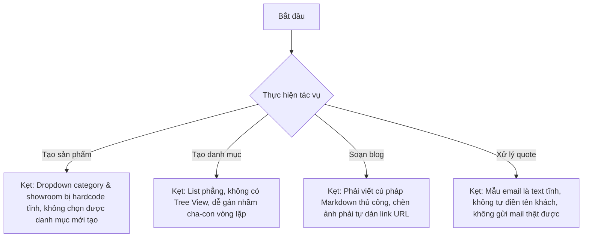

# BÁO CÁO KIỂM TRA TOÀN DIỆN HỆ THỐNG QUẢN TRỊ (ADMIN AUDIT REPORT)
**Vai trò**: Principal Product Designer + Senior Admin UX Auditor + Staff Full-stack CMS Reviewer  
**Dự án**: Showroom Nội Thất & Thiết Bị Vệ Sinh Phương Đông  
**Phương pháp**: Duyệt mã nguồn (Static Code Analysis) + Kiểm tra luồng dữ liệu (Data-flow Traceability Verification)  
**Trạng thái**: Skeptical Reality Check (Nghi ngờ thực tế, không nể nang)

---

## 1. EXECUTIVE SUMMARY (TÓM TẮT BÁO CÁO)

Sau khi kiểm duyệt kỹ lưỡng toàn bộ mã nguồn của phân hệ Admin (`app/admin`, `components/showroom`, `lib/supabase`, `app/api/admin`), tôi đưa ra các đánh giá cốt lõi sau:

### Đánh giá chung
Hệ thống Admin hiện tại sở hữu giao diện bóng bẩy (Glassmorphism shell, Live Preview trang chủ mượt mà). Tuy nhiên, **đằng sau lớp vỏ đẹp đẽ là một kiến trúc bán hoàn thiện mang tính trình diễn ("demo-like")**. Hệ thống bị đứt gãy quan hệ dữ liệu nghiêm trọng (Data-relation disconnect) giữa các thực thể động (Categories, Showrooms, Brands) với form nhập liệu chính (Products form).

### Mức độ hoàn thiện
*   **UI (Giao diện): ~75%** - Khá đẹp mắt, hiện đại nhưng thiếu nhất quán trong luồng điều hướng (sự tồn tại song song của Static Pages và Dialog Overlay).
*   **UX (Trải nghiệm người dùng): ~50%** - Khó học đối với người mới do bắt buộc viết Markdown thủ công thay vì WYSIWYG Editor. Media Library thiếu hoàn toàn tính năng tìm kiếm, lọc, và phân trang.
*   **Business/Admin Operability (Vận hành nghiệp vụ): ~55%** - Nhiều luồng liên kết quan trọng bị hardcode tĩnh hoặc xử lý nửa vời.
*   **Production-Readiness (Mức độ sẵn sàng vận hành thật): CHƯA SẴN SÀNG (NOT READY)**. Nếu đưa vào chạy thực tế, dữ liệu sẽ nhanh chóng bị sai lệch do admin nhập tay nhãn hiệu, không thể gán sản phẩm vào danh mục/showroom mới tạo, và rác cơ sở dữ liệu từ Settings Media Resolver.

---

## 2. UI AUDIT (KIỂM DUYỆT GIAO DIỆN)

### Overall Verdict: PARTIAL (Hoàn thiện một phần)
Giao diện có hierarchy tốt ở Dashboard và DataTables. Tuy nhiên, form chỉnh sửa quá dài và thiếu accordion làm xuất hiện lỗi "scroll fatigue" (mỏi mắt khi cuộn).

### Danh sách Issue theo mức độ nghiêm trọng (Severity)

#### 🚨 Critical (Nghiêm trọng - Bắt buộc sửa trước khi Launch)
*   **Màn hình / Component**: Luồng CRUD sản phẩm & danh mục (`app/admin/products` và `app/admin/categories`).
*   **Vấn đề**: Tồn tại song song 2 cơ chế sửa: Click sửa ở DataTable thì mở Dialog Modal Overlay (`AdminRouteDialog` qua searchParams `?edit=...`), nhưng nếu truy cập trực tiếp link tĩnh hoặc redirect từ router thì lại render trang tĩnh (`/admin/products/[id]/edit` và `/admin/categories/[id]/edit`). Giao diện hai nơi không đồng nhất, gây lệch layout và phân tán logic.
*   **Tác động**: Admin bị bối rối về mặt không gian giao diện, lập trình viên tốn gấp đôi công sức bảo trì code.
*   **Đề xuất Fix**: Xóa bỏ hoàn toàn các trang tĩnh (`/new`, `/[id]/edit`) ở các thư mục `products` và `categories`. Đồng nhất toàn bộ luồng CRUD qua dynamic route dialog modal.

#### ⚠️ High (Nghiêm trọng trung bình)
*   **Màn hình / Component**: Form tạo người dùng (`UserCreateEntityForm` trong `components/showroom/admin-workflows.tsx:324-330`).
*   **Vấn đề**: Các trường Họ tên và Email bị điền sẵn thông tin mặc định cứng ("Nguyễn Minh Quân", "editor@phuongdong.vn").
*   **Tác động**: Nếu admin không chú ý mà nhấn nút "Tạo", hệ thống sẽ tạo ra hàng loạt tài khoản trùng lặp hoặc tài khoản rác. Đây là lỗi UX tối kỵ trong thiết kế form.
*   **Đề xuất Fix**: Xóa toàn bộ giá trị khởi tạo (default state) của `fullName` và `email`. Để trống trường nhập liệu và đặt placeholder hướng dẫn.

*   **Màn hình / Component**: Form chỉnh sửa dài (`ContentEditorForm`, `SettingsOperationsPanel`).
*   **Vấn đề**: Quá nhiều trường nhập liệu kéo dài từ trên xuống dưới mà không có thanh điều hướng bên (scrollspy) hoặc accordion thu gọn cho các mục ít dùng (như SEO, Thuộc tính tùy chỉnh).
*   **Tác động**: Gây "scroll fatigue" cực độ cho admin khi muốn sửa nhanh một trường thông tin nhỏ.
*   **Đề xuất Fix**: Sử dụng Accordion hoặc Tabs cho nhóm trường "SEO Fieldset" và "Thông số kỹ thuật chi tiết".

#### 💬 Medium (Trung bình)
*   **Màn hình / Component**: Hộp thoại chọn ảnh (`MediaPicker` trong `components/showroom/admin-interactions.tsx:997`).
*   **Vấn đề**: Hộp thoại overlay sử dụng `z-[200]` cố định. Nếu có các thông báo toast hoặc modal nhỏ khác xuất hiện, z-index này dễ gây xung đột hiển thị.
*   **Tác động**: UI bị đè lấp, không thể thao tác nút đóng.
*   **Đề xuất Fix**: Sử dụng hệ thống Modal/Dialog chuẩn của `@/components/ui/dialog` (đã cấu hình z-index đồng bộ qua shadcn) thay vì render portal thủ công với z-index cứng.

#### ℹ️ Low (Thấp)
*   **Màn hình / Component**: Sidebar Admin Shell (`components/showroom/admin-shell.tsx:158`).
*   **Vấn đề**: Khu vực tài khoản hiển thị chữ "A" màu vàng cứng nhắc kèm text "Mô hình vai trò A" và "Hồ sơ quản trị".
*   **Tác động**: Tạo cảm giác thiếu chuyên nghiệp, mang tính chất demo thô sơ.
*   **Đề xuất Fix**: Thay thế bằng avatar thật của user đăng nhập lấy từ session, hiển thị tên thật và vai trò động ("Quản trị viên" / "Biên tập viên").

---

## 3. UX AUDIT CHO ADMIN / NGƯỜI MỚI

### UX Score theo từng Module
*   **Dashboard**: **7/10** (Trực quan, biểu đồ mượt, KPI rõ).
*   **Products**: **5/10** (Khó gán danh mục/thương hiệu thực tế).
*   **Categories**: **4/10** (List dạng phẳng rất khó hình dung quan hệ cha-con).
*   **Brands**: **6/10** (Bilingual tốt nhưng uploader logo chưa mượt).
*   **Promotions**: **5/10** (Giao diện chọn sản phẩm còn rối).
*   **Blog**: **4/10** (Bắt buộc gõ Markdown, không có WYSIWYG editor).
*   **Showrooms**: **8/10** (Tốt, có preview bản đồ và uploader hoạt động).
*   **Quotes**: **8/10** (Tốt, workflow rõ ràng, có timeline chi tiết).
*   **Users**: **6/10** (Tạo tài khoản thật nhưng thiếu tính năng reset/vô hiệu hóa tức thì).
*   **Settings**: **7/10** (Homepage Live Preview rất đáng giá).

### Top Friction Points (Điểm nghẽn trải nghiệm)

#### Cho Admin Mới (New User)
1.  **Rào cản Markdown**: Khi tạo bài viết blog hoặc mô tả sản phẩm, biên tập viên mới phải tự viết các cú pháp Markdown. Nếu họ gõ sai, tab xem trước sẽ hiển thị lỗi do parser regex tự chế (`renderMarkdownToHtml`) hoạt động không ổn định.
2.  **Mơ hồ về Cây Danh Mục**: Khi vào `/admin/categories`, danh sách phẳng dẹt dạng card không thể hiện được danh mục nào thuộc nhóm cha nào (Wood, Sanitary, Tiles). Họ phải mò mẫm tự đoán.
3.  **Nhập liệu trùng lặp**: Tạo nhãn hiệu trong Brand rồi, nhưng khi tạo sản phẩm lại phải gõ tay tên thương hiệu ở ô text input thay vì chọn từ danh sách.

#### Cho Admin Đã Quen (Power User)
1.  **Media Library Bottleneck**: Thư viện ảnh trong `MediaPicker` chỉ hiển thị tối đa 60 ảnh mới nhất mà không có phân trang, thanh tìm kiếm hay lọc theo danh mục. Khi showroom vận hành lâu dài với hàng ngàn ảnh sản phẩm, admin cũ không thể tìm lại các ảnh đã upload trước đó mà buộc phải upload lại, gây phình to dung lượng lưu trữ Cloudinary.
2.  **Thiếu Bulk Actions**: Việc cập nhật trạng thái xuất bản hoặc xóa nhiều sản phẩm/danh mục phải click từng cái một. Không có checkbox chọn hàng loạt.
3.  **Xuất báo cáo thủ công**: Thiếu nút xuất dữ liệu Quotes (báo giá) ra Excel để sales theo dõi offline.

### Task-Based Friction List



---

## 4. BUSINESS & FEATURE COMPLETENESS AUDIT

### Bảng Audit Business theo Module

| Module | Đủ business chưa | Map với client chưa | Upload ảnh thật chưa | Vấn đề chính | Verdict |
| :--- | :---: | :---: | :---: | :--- | :---: |
| **Dashboard** | **PARTIAL** | YES | N/A | KPI đếm bản ghi động tốt nhưng chart insight là dữ liệu tĩnh. | **PARTIAL** |
| **Products** | **PARTIAL** | YES | **YES** | Dropdown Category và Showroom bị viết cứng (hardcode) trong code. Brand là trường nhập text tự do. | 🚨 **DEMO_LIKE** |
| **Categories** | **PARTIAL** | YES | **YES** | UI dạng phẳng dẹt. Form edit load danh mục cha động từ DB tốt nhưng không có cây phân cấp. | **PARTIAL** |
| **Brands** | **PARTIAL** | YES | **PARTIAL** | Có DB CRUD nhưng logo upload thực chất là copy URL hoặc auto-insert size 0 từ URL. | **PARTIAL** |
| **Promotions** | **PARTIAL** | YES | **PARTIAL** | Bị lẫn lộn giữa giảm giá đơn thuần và "combo campaign". Ảnh cover là text input nhập link. | **BUSINESS_UNCLEAR** |
| **Blog** | **PARTIAL** | YES | **NO** | Markdown editor thô sơ, không chèn ảnh thật vào giữa bài viết được. | **PARTIAL** |
| **Showrooms** | **READY** | YES | **YES** | CRUD hoạt động thật, map chuẩn với client, có maps embed URL regex validation. | **READY** |
| **Quotes** | **READY** | YES | N/A | Có workflow logic, ghi status log và hiển thị timeline thật từ DB. | **READY** |
| **Users** | **PARTIAL** | YES | N/A | API tạo user auth thật. Thiếu chức năng reset password và vô hiệu hóa session lập tức. | **PARTIAL** |
| **Settings** | **PARTIAL** | YES | **YES** | Homepage sections map tốt ra client, nhưng settings media resolver tự tạo mock asset row size = 0 cho bất kỳ URL nào nhập vào. | **PARTIAL** |
| **Media** | **READY** | YES | **YES** | Upload Cloudinary thật, có db persistence. Thiếu search/filter/pagination. | **READY** |

### Mức độ Mapping với Client (Public Site)
*   **Mega Menu**: Đã lấy Categories và Brands từ DB. Tuy nhiên, việc nhóm sản phẩm tiêu biểu trên Menu vẫn đang lọc qua mảng `productGroups` tĩnh của client. Nếu admin đổi `group_key` của category trong DB, Mega Menu có thể bị lỗi hiển thị.
*   **Product Catalog (`/vi/products`)**: Các bộ lọc Brand và Discount chưa được chuyển xuống SQL query ở server mà vẫn đang dùng hàm filter client-side `filterProducts()`, điều này làm giảm hiệu năng khi số lượng sản phẩm lớn.

---

## 5. UPLOAD & MEDIA AUDIT

Đây là phần được kiểm tra rất kỹ để phát hiện các ô nhập URL "trá hình".

*   **Các module ĐÃ CÓ upload ảnh thật (Tích hợp Cloudinary + Persist DB)**:
    *   **Showrooms**: Ảnh bìa (cover image) dùng `MediaPicker` upload thật.
    *   **Categories**: Ảnh bìa danh mục dùng `MediaPicker` upload thật.
    *   **Products**: Ảnh đại diện và gallery ảnh dùng `MultiImageGalleryUpload` upload thật.
    *   **Settings**: Logo, favicon, ảnh banner slide dùng `ImageUploadDropzone` upload thật.
*   **Các module VẪN CHỈ LÀ NHẬP LINK URL (Manual URL input)**:
    *   **Brands**: Form tạo brand chỉ có ô text nhập URL logo. Nếu admin dán một link ảnh từ ngoài vào, hệ thống sẽ tự động gọi hàm `getOrCreateMediaAssetId` để insert một row "giả" vào bảng `media_assets` với kích thước `size_bytes: 0` để tránh lỗi khóa ngoại.
    *   **Promotions**: Ảnh bìa khuyến mãi vẫn là ô text nhập link URL.
*   **Module thiếu hoàn toàn**:
    *   **Blog**: Biên tập viên không thể tải ảnh từ máy tính lên để chèn vào giữa bài viết Blog. Toolbar chèn ảnh chỉ tự sinh ra cú pháp markdown `` và bắt người dùng tự điền link URL của ảnh.

---

## 6. RESPONSIVE, MODAL & FORM AUDIT

### Mobile & Tablet Admin Shell
*   **Sidebar / Navigation di động**: Trên màn hình nhỏ (mobile/tablet), thanh menu điều hướng di động (`Điều hướng quản trị di động` trong `admin-shell.tsx:230`) hiển thị dưới dạng một hàng ngang cuộn ngang (`overflow-x-auto`). Điều này rất khó bấm, dễ bị che khuất và giao diện trông chắp vá.
*   **Responsive Tables**: Các bảng dữ liệu (DataTable) trên mobile không được ẩn bớt cột phụ hoặc cấu hình scroll hợp lý, dẫn đến giao diện bị vỡ và tràn khung ngang.

### Modal & Dialog Clarity
*   `AdminRouteDialog` hoạt động mượt mà ở chế độ full-screen. Tuy nhiên, khi mở form nhập liệu dài trên mobile, thanh hành động lưu (sticky action bar ở bottom) thường bị che khuất bởi bàn phím ảo của thiết bị di động, khiến admin không thể bấm nút Lưu hoặc Hủy.

### Form Usability (Khả năng sử dụng biểu mẫu)
*   Thiếu cảnh báo thay đổi chưa lưu (Unsaved changes warning) ở các form Product/Blog. Nếu admin lỡ tay bấm phím ESC hoặc click ra ngoài modal, toàn bộ nội dung đang viết (đặc biệt là bài viết blog dài) sẽ bị mất sạch (mặc dù có bản nháp tự động lưu ở `localStorage` của Products nhưng cơ chế khôi phục khá thủ công và dễ bị ghi đè).

---

## 7. ADMIN DESIGN SYSTEM CONSISTENCY

Đánh giá mức độ đồng bộ của Design System trong Admin:

```
[Buttons] ---------> ĐỒNG BỘ CAO (Dùng chung class button-pd / button-pd-outline)
[Inputs] ----------> ĐỒNG BỘ CAO (Dùng chung input-pd và PremiumSelect)
[Cards] -----------> ĐỒNG BỘ TRUNG BÌNH (Radius và border-color ở Brand/Category còn lệch nhẹ)
[Tables] ----------> ĐỒNG BỘ CAO (Dùng chung DataTable component)
[Modals] ----------> ĐỒNG BỘ KÉM (Dialog modal CRUD dùng chung AdminRouteDialog, nhưng static pages CRUD vẫn dùng layout riêng)
[Spacing] ---------> ĐỒNG BỘ CAO (Sử dụng hệ thống space-y-5 đồng nhất)
[States] ----------> ĐỒNG BỘ TRUNG BÌNH (Loading/Skeleton tốt, nhưng disabled state của input tiếng Anh khi chưa bật bilingual nhìn khá mờ)
```

---

## 8. TOP 10 CRITICAL ISSUES (10 VẤN ĐỀ NGHIÊM TRỌNG NHẤT)

1.  **Dropdown Category & Showroom bị hardcode**: Trong form tạo sản phẩm, danh mục chỉ có 3 tùy chọn cứng (`wood`, `sanitary`, `tiles`) và showroom chỉ có 3 tùy chọn cứng. Biên tập viên không thể chọn danh mục hay showroom mới tạo từ DB.
2.  **Brand là trường text tự do**: Không có liên kết khóa ngoại với bảng `brands` trong form sản phẩm. Admin phải tự gõ tay, dễ gây sai lệch bộ lọc ở client.
3.  **Categories thiếu Tree View**: Quản lý danh mục chỉ có giao diện phẳng, gây khó khăn cho việc quản lý cấu trúc danh mục cha-con.
4.  **Blog Editor thô sơ**: Trình soạn thảo chi tiết chỉ là một `textarea` bắt buộc gõ Markdown, không thân thiện với người dùng không chuyên.
5.  **Media Picker thiếu bộ lọc và phân trang**: Chỉ hiển thị 60 ảnh mới nhất, gây mất dấu ảnh cũ trong thư viện.
6.  **Sự không nhất quán về CRUD routing**: CRUD sản phẩm/danh mục chạy song song giữa static page và dialog modal.
7.  **Form tạo User điền sẵn thông tin rác**: Gán sẵn họ tên và email demo dễ gây lỗi tạo nhầm user.
8.  **Settings Media Resolver gây rác DB**: Tự động tạo media row size = 0 cho bất kỳ link ảnh nào nhập thủ công vào Settings.
9.  **Thiếu tính năng xuất báo cáo Quote**: Admin không thể xuất danh sách yêu cầu báo giá ra file Excel/CSV.
10. **Thiếu tính năng chèn ảnh trực quan trong Blog**: Biên tập viên không thể upload ảnh trực tiếp khi đang viết nội dung bài viết.

---

## 9. PRIORITY REMEDIATION ROADMAP (LỘ TRÌNH KHẮC PHỤC)

### 🔴 Phase 1: Critical (Cần làm ngay lập tức)
1.  **Sửa Product Form Mapping**: Thay thế dropdown Category/Showroom hardcode bằng cách fetch dữ liệu động từ DB. Đổi ô nhập Brand text tự do thành `PremiumSelect` đọc từ bảng `brands`.
2.  **Đồng nhất CRUD Routing**: Xóa bỏ các trang CRUD tĩnh ở `/admin/products/new`, `/admin/products/[id]/edit`, v.v. Chuyển toàn bộ link sửa/thêm về dạng dialog query params để đồng nhất UI/UX.
3.  **Xóa dữ liệu mặc định rác**: Xóa thông tin điền sẵn ở form tạo user.

### 🟡 Phase 2: High (Cần làm sớm)
4.  **Tích hợp WYSIWYG Editor**: Thay thế `RichTextEditorMock` bằng một thư viện editor thực thụ (như TipTap hoặc CKEditor) hỗ trợ toolbar trực quan và chèn ảnh trực tiếp thông qua `MediaPicker`.
5.  **Xây dựng Tree View cho Categories**: Thiết kế giao diện danh sách danh mục phân cấp thụt đầu dòng (hoặc Tree Table) để hiển thị rõ cấu trúc cha-con.
6.  **Nâng cấp Media Picker**: Thêm tính năng phân trang (Pagination), thanh tìm kiếm theo tên file, và lọc ảnh theo ngày tải lên.

### 🔵 Phase 3: Medium (Cải thiện trải nghiệm)
7.  **Xuất báo cáo Excel cho Quotes**: Viết API endpoint hỗ trợ xuất bảng `quote_requests` ra file CSV/Excel và thêm nút "Xuất Excel" ở giao diện admin.
8.  **Refactor Settings Media Resolver**: Không tự động tạo media asset row từ link URL tự nhập. Chỉ chấp nhận media_id được chọn từ `MediaPicker`.
9.  **Cải thiện Navigation di động**: Thay thế thanh cuộn ngang di động ở Admin Shell bằng menu Hamburger rút gọn chuẩn mobile.

### 🟢 Phase 4: Low (Tối ưu hóa hệ thống)
10. **Xử lý Mojibake và Việt hóa triệt để**: Rà soát các chuỗi ký tự bị lỗi font hiển thị ở UI và đồng bộ hóa các nhãn profile người dùng.

---

## 10. FINAL VERDICT (KẾT LUẬN CUỐI CÙNG)

1.  **Admin đã đủ tốt để dùng production nội bộ chưa?**
    *   **Trả lời**: **Chưa**. Giao diện tuy đẹp nhưng luồng nghiệp vụ liên kết thực thể (Product - Category - Brand - Showroom) bị nghẽn do hardcode, dẫn đến dữ liệu nhập vào sẽ bị cô lập hoặc sai lệch ngay lập tức.
2.  **Những module nào vẫn còn “demo-like”?**
    *   **Trả lời**: Module **Products** (kẹt dropdown hardcode và ô nhập Brand tự do), module **Categories** (thiếu tree view), và module **Blog** (editor thô sơ và không chèn được ảnh).
3.  **Những module nào thiếu upload ảnh thật?**
    *   **Trả lời**: Module **Brands** và **Promotions** (vẫn dùng ô text nhập URL), phân hệ chèn ảnh nội dung của **Blog**.
4.  **Những module nào UI/UX chưa thân thiện cho admin mới?**
    *   **Trả lời**: Phân hệ soạn thảo bài viết **Blog** (bắt buộc viết Markdown) và form tạo **User** (điền sẵn thông tin rác).
5.  **Nếu chỉ được fix 10 việc trước, nên fix gì?**
    *   **Trả lời**: Chính là **Top 10 Critical Issues** được liệt kê chi tiết ở Mục 8 của báo cáo này. Ưu tiên hàng đầu là gỡ bỏ dropdown hardcode ở form sản phẩm và liên kết thương hiệu chuẩn từ DB.
