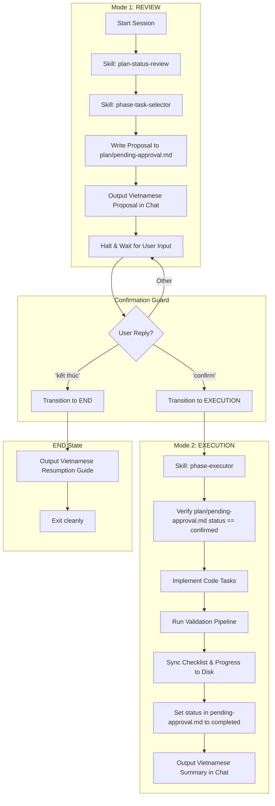

# Master Plan Orchestrator Agent Specification

This document defines the operational architecture, workflow orchestration, and state integration for the **Plan Orchestrator Agent System**. It governs how both Codex-style agents and Claude Code CLI execute tasks in this repository.

---

## 1. Orchestration Flow Architecture

The orchestrator system relies on three separate local skills and a shared state file to control state transitions and execute task slices safely.

---

## 2. Core Orchestrator Files

- **Orchestration Spec**: `plan/agent-orchestrator.md` (This file)
- **Mode Controls**: `plan/agent-modes.md` (Defines Mode 1, Mode 2, and transition logic)
- **Confirmation Protocol**: `plan/confirmation-protocol.md` (Details options and safeguards)
- **State Bridge**: `plan/pending-approval.md` (Ensures absolute coordination between Mode 1 and Mode 2)

---

## 3. Skill Integration & Claude Code Structure

The orchestrator triggers specific local skills located in `.claude/skills/` during transitions:

### A. Skill: `plan-status-review`
- **Path**: [SKILL.md](file:///d:/THCode/AI/furniture-website/.claude/skills/plan-status-review/SKILL.md)
- **Role**: Parses `execution-status.md` and checklists, identifies active blockers, and prepares the Vietnamese proposal draft.

### B. Skill: `phase-task-selector`
- **Path**: [SKILL.md](file:///d:/THCode/AI/furniture-website/.claude/skills/phase-task-selector/SKILL.md)
- **Role**: Inspects checklist items and `dependencies.md` within the active phase, enforcing deterministic selection tree rules to find the single next safe task.

### C. Skill: `phase-executor`
- **Path**: [SKILL.md](file:///d:/THCode/AI/furniture-website/.claude/skills/phase-executor/SKILL.md)
- **Role**: Reads the confirmed scope in `pending-approval.md`, implements the codebase changes, runs the command validation pipeline, performs Browser MCP journey checks for browser-visible changes, uses Playwright only as CI/headless/deterministic backup, and updates status logs on disk.

---

## 4. Operational Rules

1. **Deterministic Selection**:
   - Earliest incomplete phase wins.
   - If in-progress, continue. If blocked, halt.
   - No parallel phase work unless explicitly bypass-approved and marked parallelizable in the roadmap.
2. **Review Guard**:
   - The agent must never modify codebase files or execute database reset commands during the REVIEW mode.
3. **Bridge Verification**:
   - When launching in EXECUTION mode, the agent must load `plan/pending-approval.md` and check that the status is set to `confirmed`.
   - If the status is `pending` or `cancelled`, the agent must refuse to modify any code and stop.
4. **Vietnamese Communication**:
   - The agent must always write its chat outputs in Vietnamese using the templates defined in `plan/review-output-template.md` and `plan/execution-output-template.md`.
