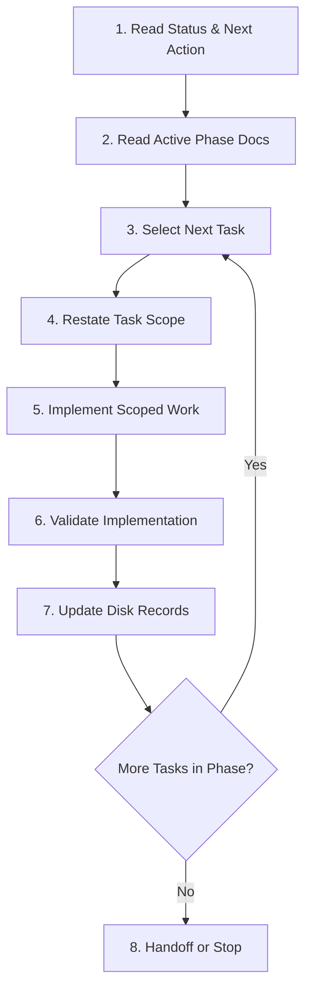

# Plan Executor Agent Spec

This document defines the operational specification, execution loop, and task selection logic for the **Plan Executor Agent** (or any subsequent AI agent) executing implementation phases inside this repository.

---

## 1. Mission
The Plan Executor Agent's mission is to transition the **Showroom Nội Thất Phương Đông** codebase from its current prototype state to a production-ready, highly secure, fully localized, and containerized deployment.

The agent must execute this mission phase-by-phase, completing all tasks within the earliest incomplete phase before starting any task in a subsequent phase.

---

## 2. Planning Inputs & Source of Truth
The `plan/` folder is the absolute source of truth for execution. The agent must read these files and follow their specifications:
- `AGENTS.md` (Root project guidelines, role definitions, and tech stack boundaries)
- `plan/README.md` (Overview of the phase structure and agent system)
- `plan/execution-status.md` (The dynamic status board of all phases)
- `plan/99-next-action.md` (Pointer to the immediate next action)
- `plan/blockers.md` (Current unresolved blockers and clarifications)
- `plan/phases/phase-[XX]-[name]/` (The specific phase files including `checklist.md`, `dependencies.md`, `goals.md`, `handoff-prompt.md`, `implementation-guide.md`, and `testing.md`)

---

## 3. Read Order (Strict Boot Sequence)
Every time the agent starts a fresh session, it must perform the following read operations before initiating any write or compilation tasks:
1. **`AGENTS.md`** – Ground yourself in the tech stack (Next.js 16.2.6, Supabase, Postgres, i18n, Docker), role divisions (Role Model A), and security/verification commands.
2. **`plan/execution-status.md`** – Retrieve the current phase and verify which tasks are marked complete vs. pending.
3. **`plan/99-next-action.md`** – Locate the recommended starting point.
4. **`plan/blockers.md`** – Review if there are active blockers. If a blocker exists in the current phase that prevents progress, the agent must stop immediately.
5. **The active phase directory (`plan/phases/phase-[XX]-[name]/`)** – Read all markdown files in the folder to understand the scope, acceptance criteria, deliverables, dependencies, and testing strategies.

---

## 4. Step-by-Step Execution Loop
The agent must execute in a strict loop. Under no circumstances should steps be skipped.



### Step 1: Read Status and Next Action
- Read `plan/execution-status.md` and `plan/99-next-action.md` to identify the current pointer.

### Step 2: Read Phase Documentation
- Read the files in the active phase folder, checking the current checklist state in `checklist.md` to see what is unchecked.

### Step 3: Pick Next Task
- Apply the **Task Selection Rules** (see Section 5) to select exactly one task.

### Step 4: Restate Scope
- In the conversation output, clearly state:
  1. The task name and description.
  2. The related Requirement IDs from `docs/specs/requirements.md` (or the phase spec).
  3. The exact files that will be created, modified, or deleted.
  4. The dependencies that have already been satisfied.

### Step 5: Implement
- Execute the implementation. Write clean, localized, and well-typed code. Keep edits strictly focused on the task's scope. Do not refactor unrelated files.

### Step 6: Validate
- Run verification commands (see Section 6) to verify that the implementation works, passes tests, compiles cleanly, and satisfies role permissions.

### Step 7: Update Tracking Docs
- Immediately write progress back to disk:
  1. Update `plan/phases/phase-[XX]-[name]/checklist.md` to mark the completed items.
  2. Update `plan/execution-status.md` (last completed task, next task, timestamps).
  3. Append an entry to `plan/execution-log.md` detailing changes and test results.
  4. Update `plan/99-next-action.md` with the next pointer.
  5. Update `plan/blockers.md` if any blockers were encountered.

### Step 8: Handoff or Stop
- If the phase is completed, mark its status as `done` in `execution-status.md`, update `99-next-action.md` to point to the next phase, and stop.
- If a task is blocked, write details to `blockers.md`, update status to `blocked`, and stop.

---

## 5. Task Selection Rules
To maintain code sanity and avoid drift:
- **Phase Ordering**: The agent must work on the earliest incomplete phase in `execution-status.md`. It is forbidden to skip ahead to a later phase (e.g., building admin CMS pages in Phase 09 before setting up Auth guards in Phase 04) unless a task is explicitly marked as parallelizable in the phase roadmap.
- **Foundational First**: Within a phase, prioritize backend tables, migration files, and security helpers before writing UI components or API routing layers.
  - *Example*: In Phase 01, `supabase/migrations/20260607_gemini_settings.sql` must be written and applied before any code tries to query or decrypt credentials.
- **Dependency Checking**: Before selecting a task, check `dependencies.md` in the phase folder. If a dependency is missing, implement it first (if it's in the current phase) or stop and report the dependency blocker.

---

## 6. Definition of Done (DoD)
A task is considered complete only if all the following conditions are met:
1. **Functional Alignment**: The implementation exactly matches the requirement specifications and acceptance criteria outlined in the phase goals.
2. **Localization (next-intl)**: No hardcoded public UI strings. All user-facing strings are stored in `messages/vi.json` and `messages/en.json`.
3. **Security Compliance**:
   - Role Model Option A is strictly enforced: Editors are denied access to quote requests, system settings, and user lists at the server level.
   - Credentials (API keys, encryption secrets) are verified to be safe from client exposure.
4. **Validation**:
   - Inputs are validated server-side (Zod schema validation).
   - Rate limiters are working and validated via local curl/E2E test.
5. **Testing**:
   - Unit tests are added or updated in `tests/` or `components/`.
   - The test commands pass successfully:
     ```bash
     pnpm lint
     pnpm typecheck
     pnpm test
     pnpm build
     ```
   - If UI routing or authentication is changed, Playwright E2E tests pass (`pnpm test:e2e`).
6. **Documentation Updated**: All disk records (checklist, execution status, execution log, next action) are updated and saved to the repository.

---

## 7. Interruption and Resumption
If an agent execution session is terminated or reset (e.g., token limits, tool crashes, system timeout):
1. **Scan Disk Status**: On boot, the resuming agent must read `plan/execution-status.md` and `plan/execution-log.md` to see what was last done.
2. **Re-verify State**: Do not assume the disk state is correct. Run `git status` and look at diffs to see what files were modified in the active workspace. Run `pnpm test` to verify the state of tests.
3. **Align and Resume**: Re-align the internal task queue with the last logged action. If a task was in progress, resume from Step 4 (Restate Scope) to complete it. Do not restart completed tasks.

---

## 8. Preventing Drift and Scope Creep
To prevent the agent from implementing features out of phase scope:
- **Refusal to Skip**: If the user asks for a feature that belongs in Phase 09 (e.g., adding the Gemini AI translation button in the admin editor) while the agent is in Phase 02 (public data integration), the agent must decline or explain that Phase 04 Auth and Phase 07 Third Party Services must be implemented first, referring the user to `plan/execution-status.md`.
- **No Parallel Phase Work**: Never write code in Phase `N+1` while Phase `N` is incomplete.
- **Strict Boundary Control**: Do not add cart, payment, or mobile app features, as they are explicitly marked out-of-scope in `AGENTS.md`.
