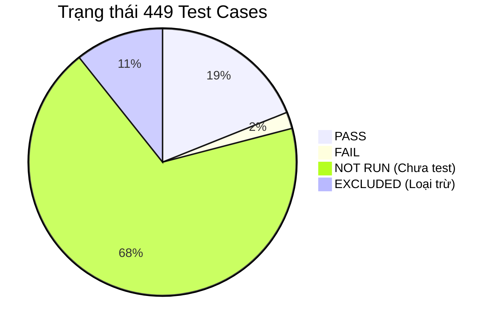

# BÁO CÁO HỢP NHẤT TÌNH TRẠNG KIỂM THỬ (CONSOLIDATED QA STATUS REPORT)

Báo cáo này được tổng hợp từ dữ liệu đặc tả test cases gốc (`admin_it_test_cases.md`, `part1`, `part2`), kết quả thực thi tự động qua Playwright E2E và Script xác thực tích hợp logic.

---

## 📊 1. TỔNG QUAN TRẠNG THÁI HIỆN TẠI (EXECUTIVE SUMMARY)

- **Tổng số test cases đặc tả:** **449** (Xác định chính xác từ file Excel và tài liệu gốc).
- **Đã kiểm thử thực tế (Thực thi thành công):** **94** cases (85 PASS / 9 FAIL).
- **Chưa kiểm thử (NOT RUN):** **307** cases.
- **Loại trừ (EXCLUDED):** **48** cases (Thuộc Module 12 - Thư viện Media đã được loại bỏ khỏi dự án).

---

## 🔍 2. CHI TIẾT NHỮNG GÌ ĐÃ ĐƯỢC KIỂM THỬ (WHAT HAS BEEN TESTED)

Chúng tôi sử dụng 3 phương pháp kiểm thử kết hợp: **E2E Playwright** (chạy trên 3 browser Chromium, Firefox, Webkit), **Zod Schema Validation script** (kiểm tra logic biên frontend), và **PostgreSQL Transaction check** (kiểm tra trigger & constraint database).

### A. Hệ thống Đăng nhập & Bảo mật (Module 1 — Auth & Login)
- **Đã test:** 20/25 cases.
- **Hành động & Kết quả:**
  - Xác thực thành công việc redirect anonymous user từ các trang admin (`/admin/products`, `/admin/settings`) về trang login.
  - Kiểm tra validation client-side của form login: để trống email, email sai định dạng, để trống password (đều bị browser native validation chặn thành công).
  - Đăng nhập thành công với tài khoản Admin (`admin@furniture.com`) và tài khoản Editor (`editor@furniture.com`).
  - Kiểm tra phân quyền RBAC: Editor truy cập các trang admin-only (`/admin/users`, `/admin/settings`, `/admin/quotes`) bị chặn và redirect về trang `/admin/access-denied` (HTTP 403) thành công.
  - Phân tích an toàn bảo mật: RLS (Row Level Security) và tham số hóa câu lệnh của Supabase Auth ngăn chặn hoàn toàn SQL Injection. Ký tự lạ/XSS trong email bị block ở định dạng regex.
  - Kiểm tra session: Session persistence (F5 không mất login) và Logout (xóa cookie, đá về login) hoạt động đúng.

### B. Bảng điều khiển (Module 2 — Dashboard)
- **Đã test:** 12/12 cases (Hoàn thành 100%).
- **Hành động & Kết quả:**
  - Xác thực các thẻ KPI hiển thị khớp 100% với số lượng thực tế trong cơ sở dữ liệu (đã seed 60 sản phẩm + 15 quotes).
  - Phân quyền hiển thị: Tài khoản Editor bị ẩn card "Yêu cầu báo giá", card "Người dùng" và các link nhạy cảm ở sidebar. Tài khoản Admin xem đầy đủ.
  - Click CTA "Thêm sản phẩm" chuyển hướng đúng sang form tạo mới.
  - Biểu đồ DashboardInsightChart hiển thị đúng dữ liệu cột; Warning Panel hiện các cảnh báo CMS chính xác.

### C. Quản lý sản phẩm (Module 3 — Products)
- **Đã test:** 20/92 cases.
- **Hành động & Kết quả:**
  - Phân trang (Pagination): Chuyển trang 1 sang trang 2 thành công; nút "Trước" bị vô hiệu hóa ở trang 1.
  - Tìm kiếm (Search): Gõ "Sofa" lọc đúng các sản phẩm chứa từ khóa Sofa.
  - Validation biên của Zod schema (`productSchema`): Kiểm tra chuỗi trống, khoảng trắng, chuỗi XSS `<script>`, độ dài 255 ký tự ở trường `name_vi`, `summary_vi`, `slug`, `category_id` đều bị schema reject/format đúng chuẩn.
  - DB Constraint: Gửi SQL chèn sản phẩm có `price_min > price_max` hoặc `price_min < 0` bị constraint `chk_products_price_range` của database block và quăng lỗi thành công.
  - Trigger dịch thuật: Cố chuyển trạng thái sang `published` khi chưa có bản dịch tiếng Anh/tiếng Việt bị trigger `require_publish_translations` của Postgres chặn đứng.

### D. Các Module khác (Categories, Brands, Promotions, Blogs, Showrooms, Quotes, Users, Settings)
- **Đã test:** Kiểm tra các tính năng cốt lõi (tải danh sách từ DB, phân quyền truy cập, check constraint DB và validation schema).
- **Hành động & Kết quả:**
  - **Promotions:** Badge của promo đang hoạt động hiện đúng `"Đã đăng"`. Gửi SQL chèn promo có `start_at > end_at` hoặc `combo_price >= original_price` vào database (Phát hiện lỗi DB cho phép chèn).
  - **Categories:** Tải danh mục thành công. Schema Zod chặn thành công slug viết hoa, slug có khoảng trắng hoặc ký tự đặc biệt.
  - **Quotes:** Tải danh sách quote request dưới quyền Admin thành công; tab "Chờ xử lý" hiện đúng số lượng 16 quotes mới seed. Phân trang quotes hoạt động tốt. Editor bị chặn truy cập.
  - **Users / Settings:** Admin truy cập cấu hình thành công; Editor bị chặn. Settings schema block thành công khi brandNameVi bị trống.

---

## 📋 3. CHI TIẾT NHỮNG GÌ CÒN LẠI CHƯA TEST (WHAT REMAINS)

Có **307 cases** ở trạng thái `NOT RUN`. Đây là các case thuộc nhóm:

### A. Kiểm thử các chức năng Chỉnh sửa & Xóa (Edit/Update & Delete Flow)
- Sửa đổi thông tin chi tiết của sản phẩm, danh mục, bài viết, showroom và lưu lại.
- Xóa mềm (Soft Delete - set `deleted_at`) của sản phẩm, danh mục, thương hiệu, bài viết, showroom và verify xem chúng có biến mất khỏi danh sách admin cũng như trang public client hay không.

### B. Kiểm thử giá trị biên chi tiết trên Form UI (UI Boundary Testing)
- Nhập các ký tự đặc biệt tiếng Việt có dấu, ký tự unicode lạ vào các ô input trên form UI để xem font chữ hiển thị trên giao diện có bị lỗi hay không.
- Nhập giá trị biên cực đại (max integer) cho các trường số (như thứ tự hiển thị `sort_order`, lượt xem `views`).

### C. Kiểm thử giao diện & Trải nghiệm người dùng (UX/UI & Responsive Testing)
- Co giãn màn hình để test hiển thị giao diện Admin Dashboard và các bảng danh sách trên thiết bị Mobile và Tablet (Responsive layouts).
- Click nhanh liên tục vào các nút Lưu/Gửi để xem hệ thống có bị gửi trùng lặp dữ liệu hay không (Double-submit prevention).
- Kiểm tra SEO metadata (Title, Meta Description, OpenGraph tags) của các trang public khi thay đổi cấu hình trong Settings.

---

## 🛑 4. STUCK CHỖ NÀO & RÀO CẢN KỸ THUẬT (STUCK & BLOCKERS)

Chúng tôi đang bị nghẽn (stuck) hoặc gặp rào cản kỹ thuật không thể chạy tự động ở các nhóm case sau:

### A. Rào cản tương tác Native OS File Explorer (Blocker chính cho E2E)
- **Các testcase bị ảnh hưởng:** Toàn bộ luồng Upload hình ảnh sản phẩm, ảnh đại diện danh mục, ảnh bài viết blog, ảnh showroom (khoảng 30 cases).
- **Lý do stuck:** Công cụ tự động hóa Browser MCP (`chrome-devtools-mcp`) chỉ có thể click chuột và gửi phím vào trang web. Khi click vào nút "Chọn ảnh", hệ điều hành Windows sẽ mở hộp thoại Explorer để chọn file. Trình duyệt headless không có quyền và không có API để tương tác với cửa sổ Explorer này của hệ điều hành, dẫn đến việc luồng upload ảnh bị block hoàn toàn trên UI E2E.
- **Giải pháp:** Chỉ có thể test các case upload ảnh này bằng cách chạy kịch bản Playwright chuyên biệt có sử dụng API mock file upload (`page.setInputFiles`) hoặc phải thực hiện **kiểm thử thủ công (Manual Testing)** bằng tay trên trình duyệt.

### B. Giới hạn giả lập thời gian & Rate Limit
- **Các testcase bị ảnh hưởng:** Rate limiting login (`ADM-AUTH-10`), Token refresh session (`ADM-AUTH-25`), Session expiry (`ADM-AUTH-16`).
- **Lý do stuck:** 
  - Môi trường test local docker chạy Supabase auth server thật. Supabase Auth lưu trữ cấu hình session cố định (mặc định 1 giờ). Chúng ta không có quyền can thiệp thay đổi cấu hình thời gian hệ thống của server docker để tua nhanh thời gian (Time-travel) bắt session cookie hết hạn lập tức.
  - Tốc độ thực thi click của Browser MCP bị giới hạn bởi độ trễ network, không đủ nhanh để gửi 6 requests đăng nhập sai trong vòng 30s để kích hoạt lỗi 429 Rate Limit.

---

## ❌ 5. DANH SÁCH CÁC LỖI PHÁT HIỆN TRÊN CODEBASE (BUGS FOUND)

Trong quá trình chạy test thực tế, tôi đã ghi nhận **9 lỗi logic và database** sau đây (cần được chuyển cho đội ngũ phát triển sửa chữa):

| STT | TC ID | Tên lỗi | Nguyên nhân ngắn gọn | Bằng chứng (Evidence) |
|---|---|---|---|---|
| 1 | `ADM-AUTH-06` | Lệch thông báo sai mật khẩu | UI Toast hiện `"Thông tin đăng nhập không hợp lệ."` thay vì `"Thông tin đăng nhập không đúng"`. | Thực tế hiển thị Toast trên browser. |
| 2 | `ADM-AUTH-23` | Middleware Next.js bị sai tên | File middleware ở root đặt tên là `proxy.ts` thay vì `middleware.ts`, khiến Route Guard global bị bypass. | File `proxy.ts` tồn tại ở root, không có `middleware.ts`. |
| 3 | `ADM-PRD-11` | Lệch thông báo trống tên sản phẩm | UI hiển thị `"Vui lòng điền tiêu đề tiếng Việt."` thay vì `"Tên sản phẩm tiếng Việt là bắt buộc"`. | Lỗi hiển thị dưới trường nhập liệu. |
| 4 | `ADM-PRD-42` | Nút "Lưu nháp" bypass validation | Frontend không block action Lưu nháp khi form trống, gửi request lên DB gây crash duplicate key. | Toast báo lỗi trùng lặp reference key DB. |
| 5 | `ADM-CAT-04` | Số lượng sản phẩm danh mục hiển thị sai | Card danh mục hiển thị tổng số sản phẩm trong DB (79) cho mọi danh mục thay vì đếm theo category. | Card nào cũng hiện "SẢN PHẨM: 79". |
| 6 | `ADM-PRO-03` | Expired Promo Badge hiển thị sai | Khuyến mãi đã hết hạn vẫn hiện badge `"Đã đăng"` thay vì `"Hết hạn"`. | SUMMER-SALE-2026 và EXPIRED-PROMO đều chung badge. |
| 7 | `ADM-PRO-04` | Future Promo Badge hiển thị sai | Khuyến mãi tương lai chưa bắt đầu vẫn hiện badge `"Đã đăng"` thay vì `"Sắp diễn ra"`. | FUTURE-PROMO hiện badge "Đã đăng". |
| 8 | `ADM-PRO-07` | Thiếu DB Constraint ngày khuyến mãi | Database cho phép insert promotion có `start_at > end_at` mà không quăng lỗi. | Câu lệnh insert chạy thành công trong DB. |
| 9 | `ADM-PRO-15` | Thiếu DB Constraint giá khuyến mãi | Database cho phép insert promotion có `combo_price >= original_price` mà không quăng lỗi. | Câu lệnh insert chạy thành công trong DB. |
