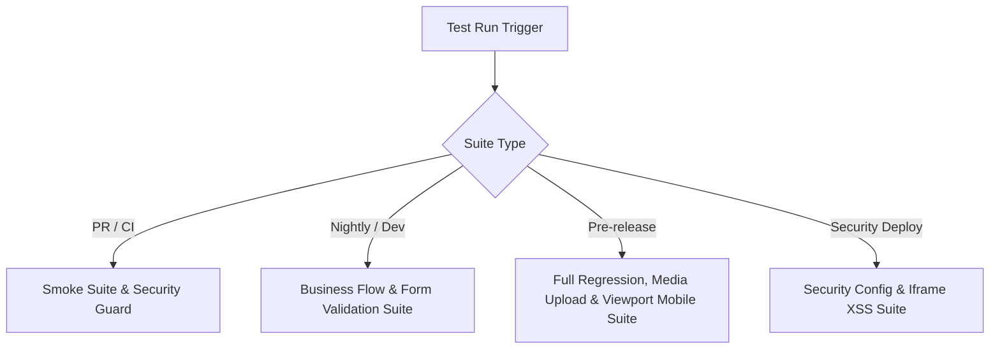

# TEST MASTER PLAN — HỆ THỐNG WEBSITE NỘI THẤT & THIẾT BỊ VỆ SINH

## 1. Test Strategy Summary

### 1.1. Mục tiêu chiến dịch Test
- **Đảm bảo tính toàn vẹn dữ liệu (Data Integrity):** Ngăn chặn triệt để lỗi mất liên kết media, lỗi mismatch schema giữa Frontend (FE) và Backend (BE)/Database (DB), đặc biệt là trong các tính năng upload ảnh sản phẩm, danh mục, thương hiệu, và lưu trữ các quote request.
- **Bảo mật tuyệt đối (Security Enforcement):** Đảm bảo middleware chặn đúng các route `/admin/*` cho anonymous users, loại bỏ fallback mặc định `user?.role ?? "admin"`. Chặn hoàn toàn rò rỉ secrets qua Docker layers và các lỗi Stored XSS trong iframe maps.
- **Độ tin cậy của luồng nghiệp vụ (Business Flow Reliability):** Đảm bảo dữ liệu tạo ở trang Admin được render chính xác ở Client public với các thuộc tính cần thiết (giá bán, giá combo, ảnh bìa, trạng thái hiển thị).
- **Tính ổn định của AI Feature:** Kiểm soát chặt chẽ payload gửi lên API AI generation, khả năng parse output, cơ chế phục hồi dữ liệu khi AI generation lỗi/timeout và chống XSS từ các trường động.

### 1.2. Phạm vi áp dụng
Toàn bộ codebase Next.js App Router (14+), Supabase Database (PostgreSQL), Cloudinary Integration, Middleware, và các API Routes tương tác.

### 1.3. Nguyên tắc kiểm thử
- **Thực chiến & Bám sát Codebase:** Không viết test mang tính lý thuyết sách giáo khoa. Mọi ca test phải có thông số đầu vào, điều kiện pass/fail và logic kiểm tra cụ thể gắn liền với cấu trúc bảng Supabase và UI components hiện tại.
- **Không che giấu lỗi bằng mock ở tầng E2E:** Các test E2E/Browser MCP phải tương tác với cơ sở dữ liệu thật (hoặc DB testing instance biệt lập nhưng đầy đủ schema và RPCs). Chỉ mock ở tầng Unit Test và tích hợp của bên thứ ba (như Cloudinary API, OpenAI/Gemini API). Tránh mock che giấu các lỗi 502/504 thực tế của nhà cung cấp AI.
- **Idempotency (Tính trơn tru, không gây rác dữ liệu):** Mọi kịch bản ghi đè dữ liệu (Create/Update/Delete) phải đi kèm chiến lược dọn dẹp dữ liệu (cleanup) tự động để tránh xung đột khi chạy lại kịch bản (idempotent design).

### 1.4. Vùng rủi ro cao nhất (High-Risk Areas)
1. **Media Upload & Linking Flow:** Lịch sử lỗi không INSERT dữ liệu vào junction table `product_media`, drop ID ảnh tại `ImageUploadDropzone` (chỉ truyền URL string), sinh "ghost assets" với size_bytes = 0.
2. **FE/BE Validation Mismatch:** Zod schema ở FE không đồng bộ với BE (các form Admin Brand, Promotion, Settings, Showrooms thiếu Zod validation ở BE).
3. **RPC Contracts & Enum Mismatches:** Hàm RPC `update_quote_status` chứa enum không tồn tại trên DB (`processing`, `cancelled`) hoặc bị Unauthorized do gọi sai client (dùng service_role client làm `auth.uid() = null`).
4. **Data Mapping Admin -> Client:** RPC `public_promotions` hoặc `public_products` trả về thiếu các trường mở rộng (`cover_media`, `combo_price`, `original_price`, `brand_id`), khiến UI client bị lỗi layout/thiếu thông tin hoặc bộ lọc thương hiệu luôn trả về 0.
5. **Auth Guard & Role Fallback:** Lỗi bypass trang admin do middleware cấu hình sai file (`proxy.ts` thay vì `middleware.ts`) hoặc fallback `role = "admin"` khi user chưa đăng nhập.
6. **Docker Layer Secrets Leak (B03):** Tệp cấu hình `.env.production` chứa các keys nhạy cảm (`SUPABASE_SERVICE_ROLE_KEY`, `RESEND_API_KEY`) bị đóng gói vào Docker layer do thiếu trong `.dockerignore`.
7. **Stored XSS Showroom Maps (R01):** Nhúng bản đồ showroom bằng `dangerouslySetInnerHTML` với iframe thô từ DB mà không qua sanitize.

---

## 2. Test Pyramid for This Project

| Layer | Goal | Main targets | Tools | Mock vs Real |
|---|---|---|---|---|
| **Unit Test (UT)** | Đảm bảo tính đúng đắn của logic tính toán, parse dữ liệu, định dạng, validation schemas độc lập. | Zod Schemas (`quoteRequestSchema`, `categorySchema`, `settingsSchema`), Helpers (`formatPrice`, `parseSlug`, `buildAiPayload`). | **Vitest / Jest** | **100% Mock** DB và External Services. |
| **Integration Test (IT)** | Kiểm thử API Routes, Server Actions, các hàm truy vấn DB (Supabase repository layer) và RPC Contracts. | `POST /api/admin/media/upload`, `PUT /api/admin/settings`, `update_quote_status` RPC callers, `/api/contact`. | **Vitest + Supabase Test DB / Supertest** | **Real DB** (Local/Docker test instance), **Mock** Cloudinary API & AI Provider API. Sử dụng session client thực tế thay vì service client để kiểm tra đúng phân quyền RPC. |
| **E2E Browser Test** | Giả lập hành vi người dùng trên trình duyệt thật để kiểm tra toàn bộ luồng nghiệp vụ từ Admin đến Client Public. | Luồng: Tạo sản phẩm/danh mục -> Tải ảnh lên -> Lưu -> Mở trang Client -> Filter tìm kiếm -> Kiểm tra giao diện. | **Playwright** | **Real DB & Real App Routing**. Mock AI response (nếu cần tốc độ) hoặc dùng Sandbox keys. Tránh mock che giấu lỗi 502/504. |
| **Browser MCP** | Thực thi exploratory testing, validation nhanh giao diện, smoke test sau deployment và debug console/network. | Smoke test hiển thị layout, điền nhanh form và upload ảnh thực tế trên môi trường staging/production. Kiểm tra LCP/CLS và console error. | **chrome-devtools-mcp** | **Real System** (Staging/Production). Không mock. |

---

## 3. Test Scope Matrix

| Module | UT | IT | E2E | Browser MCP | Priority | Notes |
|---|---|---|---|---|---|---|
| **Auth & Security** | ✅ Check role fallback logic | ✅ Server Actions auth, Session verification | ✅ Login, Redirects, Middleware bypass guard | ✅ Smoke check admin routes block anonymous | **CRITICAL** | Chặn lỗi `user?.role ?? "admin"`, quét Docker build context phát hiện `.env.production` rò rỉ. |
| **Media Library / Upload** | ✅ Type/Size validators, Path generators | ✅ `POST /api/admin/media/upload`, check DB records | ✅ Upload UI, Media Picker, Chọn ảnh từ Library, Link to Entity | ✅ Multi-viewport upload, Broken connection recovery | **CRITICAL** | Chống trôi mediaId ở `ImageUploadDropzone`, link đúng bảng `product_media`, assert size_bytes > 0. |
| **Products** | ✅ Zod validation, Param mappers | ✅ DB calls, RPC `public_products` signature checks | ✅ Admin Create -> Client Detail rendering (images, brand, specs) | ✅ Filter & Sorting verification, Desktop & Mobile layout | **CRITICAL** | Kiểm tra category dropdown dynamic (không hardcode), render ảnh đầy đủ. |
| **Promotions** | ✅ Validation schemas | ✅ RPC `public_promotions` (cover_media, price mapping) | ✅ Create promo -> Map to product -> Client promo page check | ✅ Verify date-time visibility triggers (`start_at`, `end_at`) | **HIGH** | Sửa triệt để lỗi hardcode ngày `now = new Date("2026-06-19...")` ở Client. |
| **Quotes (Báo giá)** | ✅ Phone, Email formatting validators | ✅ `/api/contact` -> DB insert, `quote_request_events` insert | ✅ Public Quote Submit -> Admin Quote List -> Update Status | ✅ Role permissions checking (Editor vs Admin status updates) | **HIGH** | Chống lỗi RPC enum mismatch (`processing`, `cancelled`) và Unauthorized. |
| **Settings** | ✅ Zod schema verification | ✅ `PUT /api/admin/settings` payload validations | ✅ Save site settings -> Public header/footer/contact dynamic update | ✅ Dynamic theme/favicon checks | **HIGH** | Settings form phải được validate đầy đủ ở cả FE và BE. Chặn hiển thị plain text API keys. |
| **AI Features** | ✅ API payload builder, JSON output parser | ✅ `/api/admin/ai/generate` API endpoints | ✅ Click Generate -> Auto-fill Form -> Save draft | ✅ Exploratory prompts, error recovery flows | **MEDIUM** | Đảm bảo sanitation, không mất data cũ khi AI generation thất bại (502/504). |
| **Brands & Categories** | ✅ Slug generators, unique checks | ✅ DB constraints, Cascade deletes | ✅ Admin create Brand -> Client Product Filter dynamic updates | ✅ Showroom/Brand mapping validation | **HIGH** | Sửa lỗi Brand form dạng text-input tự do thành dynamic selection FK. Check circular category loop. |
| **Showrooms** | ✅ Coordinate validations | ✅ Map embed input validations | ✅ Create showroom -> Google map embed rendering (sanitized) | ✅ Mobile responsive layout rendering | **MEDIUM** | Triệt tiêu nguy cơ XSS qua trường iframe map nhúng thô từ DB. |
| **Blog** | ✅ Slug & Tag parsing | ✅ Content page data fetch | ✅ Publish post -> Client listing/detail view | ✅ Layout LCP image optimize, Category tags filtering | **MEDIUM** | Blog tag filtering phải hoạt động thực tế thay vì chỉ hiển thị tĩnh. |

---

## 4. Business Flow Coverage

| Flow ID | Flow name | Steps | Expected result | Layer(s) |
|---|---|---|---|---|
| **BF-01** | **Product Catalog Lifecycle** | 1. Admin login.<br>2. Tạo Brand mới (ví dụ: "Eurotile").<br>3. Tạo Category mới (ví dụ: "Gạch ốp tường").<br>4. Tạo Product mới: chọn Brand, Category vừa tạo từ dropdown dynamic; tải ảnh đại diện và gallery thông qua Dropzone.<br>5. Nhấn Save.<br>6. Truy cập Client Public trang Listing và Detail của Product đó. | - Brand & Category được hiển thị động trong dropdown trang tạo sản phẩm.<br>- Ảnh tải lên được lưu thành công vào bảng `media_assets` (cột `original_filename` không bị null, `size_bytes > 0`).<br>- Bản ghi junction `product_media` được tạo chính xác (không bị bỏ trống).<br>- Client hiển thị đúng sản phẩm kèm theo tên Brand, Category, ảnh bìa sắc nét. | IT, E2E |
| **BF-02** | **Promotion Execution & Validity** | 1. Admin tạo Promotion mới: Set tên, % giảm giá, chọn sản phẩm áp dụng.<br>2. Cấu hình thời gian chạy: `start_at` = Tương lai, `end_at` = Tương lai + 5 ngày.<br>3. Kiểm tra Client trang Khuyến mãi.<br>4. Sửa `start_at` = Quá khứ, `end_at` = Tương lai.<br>5. Kiểm tra lại Client trang Khuyến mãi. | - Khi `start_at` ở tương lai: trang khuyến mãi Client **không** hiển thị chương trình.<br>- Khi `start_at` ở quá khứ và `end_at` ở tương lai: trang khuyến mãi Client hiển thị chính xác thẻ chương trình kèm theo ảnh bìa và danh sách sản phẩm được giảm giá (giá gốc vs giá combo hiển thị đúng thông qua RPC `public_promotions` cập nhật). | E2E, Browser MCP |
| **BF-03** | **Quote Request & Lifecycle Trail** | 1. Client truy cập trang chi tiết sản phẩm "Bồn cầu thông minh".<br>2. Điền Form báo giá (QuoteForm): Nhập Tên, SĐT hợp lệ, Email trống, Message > 20 ký tự.<br>3. Submit form.<br>4. Admin login -> vào mục Quản lý báo giá.<br>5. Admin đổi trạng thái báo giá từ `pending` sang `contacted`. | - Client nhận thông báo submit thành công (hệ thống lưu vào DB).<br>- Tạo sự kiện audit log trong bảng `quote_request_events` gắn liền với quote đó khi submit từ public form (không bị bypass).<br>- Admin nhìn thấy báo giá mới.<br>- Đổi trạng thái thành công (RPC `update_quote_status` chạy thành công bằng session client, không bị Unauthorized hay lỗi DB Enum). | IT, E2E |
| **BF-04** | **Site Identity Propagation** | 1. Admin truy cập Settings.<br>2. Cập nhật Hotline thành "1900 8888", Email liên hệ thành "contact@company.vn", tải logo mới.<br>3. Lưu cài đặt.<br>4. Truy cập Client Public trang Homepage, Contact, Product Detail, và Footer. | - API `PUT /api/admin/settings` validate và persist DB thành công.<br>- Client Homepage, Contact, Product Detail, Footer lập tức hiển thị Hotline "1900 8888" và Email mới, không còn tình trạng hardcode thông tin cũ (`1800 6089`, `08172 357 587`). | IT, E2E, Browser MCP |
| **BF-05** | **AI Assistant Form Filler** | 1. Admin mở form tạo mô tả Product.<br>2. Nhập một số thông số thô (Ví dụ: "kích thước 80x80, men bóng, chống trượt tốt").<br>3. Chọn "Generate Description by AI".<br>4. Nhận kết quả từ AI, chỉnh sửa một số từ.<br>5. Lưu Product. | - Payload gửi lên AI API định dạng chính xác.<br>- API parse đúng nội dung sinh ra và điền tự động vào editor.<br>- Nếu AI API trả về lỗi 502/504 (timeout/quota), hệ thống hiển thị thông báo lỗi thân thiện và giữ nguyên nội dung thô người dùng đã điền trước đó. | UT, IT, E2E |

---

## 5. Form Coverage Matrix

| Form | Create | Edit | Validation | Upload | Publish | Role | Priority |
|---|---|---|---|---|---|---|---|
| **Product Form** | ✅ Sạch dữ liệu nháp cũ | ✅ Load đúng Brand FK, Category FK, dynamic select | ✅ FE check tên, giá, kích thước. BE validate schema. Cross-field: price_min <= price_max, promo < price. | ✅ Upload Cover + Gallery. Lưu junction `product_media`. | ✅ Guard: Phải có ảnh bìa mới được publish. | Admin/Editor | **CRITICAL** |
| **Category Form** | ✅ Tạo slug tự động từ tên | ✅ Đổi tên -> Cập nhật slug (cảnh báo đổi link) | ✅ FE Zod validation. BE check unique slug. Chặn circular reference cha/con. | ✅ Cover image upload thành công. | ✅ Trực quan hóa danh mục cha/con. | Admin | **HIGH** |
| **Brand Form** | ✅ Tạo logo + mô tả | ✅ Load dữ liệu cũ | ✅ FE/BE Zod validation (tên required, check unique slug). | ✅ Logo image upload & persist. | ✅ Hiển thị tức thì trên bộ lọc. | Admin | **HIGH** |
| **Promotion Form** | ✅ Date picker binding | ✅ Thay đổi ngày, chọn lại list sản phẩm | ✅ FE/BE check `end_at` > `start_at`, % giảm từ 1-90%. Combo_price < original_price. | ✅ Tải ảnh banner chương trình. | ✅ Active/Deactive toggle. Phải có ít nhất 1 sản phẩm liên kết. | Admin | **HIGH** |
| **Blog Form** | ✅ Editor render tốt | ✅ Load block content | ✅ Validate title, slug, categories. | ✅ Thumbnail upload + inline image block assets. | ✅ Trạng thái Draft vs Published hoạt động đúng. Phải có ảnh bìa khi publish. | Admin/Editor | **MEDIUM** |
| **Showroom Form** | ✅ Gắn bản đồ embed | ✅ Cập nhật tọa độ | ✅ Validate định dạng URL Google Map (chặn iframe chứa script độc hại). | ✅ Tải ảnh thực tế showroom. | ✅ Hiển thị map trên client. | Admin | **MEDIUM** |
| **User Form** | ✅ Trống default text | ✅ Đổi mật khẩu / đổi Role | ✅ FE/BE validate định dạng email, password strength (min 8 ký tự). | ❌ Không có | ✅ Kích hoạt/Khóa tài khoản. Chặn tự deactivate chính mình. | Admin | **HIGH** |
| **Settings Form** | ✅ Config đa dạng | ✅ Cập nhật từng tab | ✅ FE/BE check định dạng email, hotline (VN phone), key formats (starts with re_). | ✅ Tải Logo, Favicon, Banner footer. | ✅ Thay đổi diện mạo client tức thì. API keys masking (`type="password"`). | Admin | **HIGH** |
| **Quote Form** | ✅ Gửi thông tin mới | ❌ N/A (Client only) | ✅ Validate SĐT (`^(\+?[0-9]{7,15})$`), email (nếu điền), message (min 20 ký tự). | ❌ Không có | ✅ Submit trực tiếp. | Anonymous | **CRITICAL** |
| **Admin Login** | ✅ Form trống | ❌ N/A | ✅ Check định dạng email, chặn SQL Injection. Inline error tiếng Việt. | ❌ Không có | ✅ Xác thực qua Supabase. | Anonymous | **CRITICAL** |

---

## 6. Media & Upload Coverage

| Entity | Upload source | Persist target | Client render target | Critical assertions |
|---|---|---|---|---|
| **Product Media** | `ImageUploadDropzone` (Cover & Gallery) | Bảng `media_assets` + junction `product_media` | Trang chi tiết sản phẩm `/products/[slug]`, thẻ sản phẩm `/products` | - Trả về UUID `mediaId` chuẩn sau khi upload.<br>- Bản ghi `product_media` chứa đúng `product_id` và `media_id` (không rỗng).<br>- Thứ tự gallery được tôn trọng.<br>- Alt-text SEO được lưu và hiển thị đúng.<br>- Ảnh hiển thị thẻ `<Image>` Next.js tối ưu LCP. |
| **Category Cover** | Dropzone đơn | Cột `cover_media_id` (FK) bảng `categories` | Header danh mục trang `/products?category=slug` | - Khi xóa danh mục, không xóa vật lý ảnh trên Cloudinary lập tức mà hủy FK hoặc đánh dấu soft-delete.<br>- Chọn ảnh cũ từ thư viện không sinh ra bản ghi asset trùng lặp. |
| **Brand Logo** | Dropzone đơn | Cột `logo_media_id` (FK) bảng `brands` | Trang chủ (Brand slider), trang bộ lọc sản phẩm | - Logo được co giãn về tỷ lệ 1:1 hoặc tối ưu kích thước tự động.<br>- Không bị mất liên kết logo khi cập nhật thông tin chữ của Brand. |
| **Promotion Cover** | Dropzone đơn | Cột `cover_media_id` (FK) bảng `promotions` | Banner trang `/promotions` | - Trả về đúng ảnh có kích thước banner chữ nhật.<br>- RPC `public_promotions` trả về ảnh thay vì giá trị null. |
| **Blog Cover** | Dropzone đơn | Cột `cover_media_id` (FK) bảng `posts` | Trang danh sách bài viết `/blog` | - Ảnh bìa hiển thị sắc nét, hỗ trợ responsive cho mobile viewport. |
| **Showroom Image** | Dropzone đơn | Cột `image_media_id` (FK) bảng `showrooms` | Trang hệ thống showroom `/showrooms` | - Ảnh tải lên hiển thị đúng thông số alt-text. |
| **Settings Assets** | Dropzone đơn cho Logo/Favicon | Cột `logo_id`, `favicon_id` bảng `site_settings` | Toàn bộ các trang (Navbar, Footer, Tab browser) | - Favicon hiển thị đúng định dạng `.ico` hoặc `.png` kích thước nhỏ.<br>- Logo navbar hiển thị chuẩn trên cả giao diện sáng/tối. |

---

## 7. AI Feature Coverage

| Feature | UT | IT | E2E | Failure cases | Notes |
|---|---|---|---|---|---|
| **API Route AI Generation** | ✅ Check format payload (prompt, prompt length, system prompt) | ✅ Endpoint `/api/admin/ai/generate` trả về đúng cấu trúc JSON | ✅ Bấm "Generate" trên admin UI -> Text editor tự đổ dữ liệu | - API trả về 504 Gateway Timeout.<br>- Quá hạn quota API key.<br>- AI trả về chuỗi Markdown lỗi. | Hệ thống phải fallback hiển thị thông báo thân thiện và giữ nguyên text thủ công do user viết trước đó. |
| **Auth & Permission** | ❌ N/A | ✅ Call AI route bằng anonymous client -> Mong đợi 401 | ✅ Đăng nhập với Editor role -> Thực hiện generate thành công | - Token hết hạn giữa chừng khi đang chờ AI response. | Đảm bảo chặn mọi request không có valid session từ admin dashboard. |
| **Output Sanitation** | ✅ Parser lọc bỏ các thẻ nguy hiểm (`<script>`, `onload=`) | ✅ API lọc ký tự đặc biệt gây lỗi phá vỡ cấu trúc JSON | ✅ Dữ liệu sinh ra render lên editor an toàn, không tự kích hoạt script | - AI trả về mã HTML thô chứa mã độc do prompt injection. | Dùng DOMPurify hoặc thư viện parse an toàn trước khi insert vào editor. |

---

## 8. Browser / MCP Execution Plan

### 8.1. Các Suite Test chi tiết



#### Suite 1: Browser Smoke Suite
- **Mục tiêu:** Kiểm tra nhanh độ sống sót của các trang cốt lõi, không có lỗi trắng trang (white screen) hoặc lỗi 500. Đo lường LCP.
- **Tần suất:** Mỗi pull request (PR) và sau mỗi lần deploy.
- **Routes cover:** `/`, `/products`, `/promotions`, `/blog`, `/showrooms`, `/contact`, `/admin/login`.
- **Preconditions:** Hệ thống đã được deploy lên môi trường preview/staging.
- **Data setup:** Dữ liệu seed mặc định.
- **Assertions:**
  - HTTP Status Code = 200.
  - Thẻ `<h1>` tồn tại trên trang.
  - Không có lỗi uncaught exception trong console trình duyệt.
  - Performance: LCP < 2.5s, CLS < 0.1, TBT < 200ms.
- **Blocking:** Có. Fail suite này sẽ hủy đợt deploy.

#### Suite 2: Browser Form Validation & Role Suite
- **Mục tiêu:** Xác minh các ràng buộc nhập liệu ở cả FE & BE hoạt động đồng bộ, phân quyền admin/editor chuẩn xác.
- **Tần suất:** Chạy hàng đêm (Nightly build).
- **Routes cover:** `/admin/products/new`, `/admin/settings`, `/admin/users/new`, `/admin/login`.
- **Preconditions:** Đã đăng nhập tài khoản test (Role: Editor).
- **Data setup:** Dùng tài khoản editor đã seed sẵn.
- **Assertions:**
  - Editor truy cập được trang tạo sản phẩm nhưng không vào được trang quản lý Users (Redirect về dashboard kèm thông báo 403).
  - Điền SĐT sai định dạng trên QuoteForm -> Thấy inline error tiếng Việt tức thì.
  - Gửi payload rỗng lên endpoint API -> Nhận mã lỗi 400 kèm chi tiết trường thiếu.
- **Blocking:** Có.

#### Suite 3: Browser Upload & Media Persistence Suite
- **Mục tiêu:** Đảm bảo luồng tải ảnh, chọn ảnh thư viện, liên kết ảnh vào sản phẩm không bị đứt gãy.
- **Tần suất:** Hàng đêm (Nightly build) và Trước khi release.
- **Routes cover:** `/admin/products/new`, `/admin/media`.
- **Preconditions:** Đã đăng nhập tài khoản Admin. Chuẩn bị sẵn bộ file ảnh test (PNG, JPG, kích thước lớn > 15MB, file lỗi định dạng .txt).
- **Data setup:** Reset thư viện media về trạng thái sạch trước khi chạy.
- **Assertions:**
  - Tải ảnh 16MB -> Hiển thị cảnh báo dung lượng vượt quá giới hạn (Max 10MB), không gửi request lên Cloudinary.
  - Tải ảnh 2MB -> Upload thành công, DB `media_assets` sinh dòng mới với `original_filename` đúng, `size_bytes > 0`.
  - Lưu sản phẩm -> Bản ghi `product_media` được tạo. Client `/products/[slug]` hiển thị đúng thẻ `<Image>` Next.js.
- **Blocking:** Có.

#### Suite 4: Mobile Viewport & Responsiveness Suite
- **Mục tiêu:** Kiểm tra giao diện, bộ lọc sản phẩm, menu hamburger và QuoteForm hiển thị tốt trên thiết bị di động.
- **Tần suất:** Trước khi release.
- **Routes cover:** Trang chủ, `/products`, `/products/[slug]`, `/contact`.
- **Preconditions:** Giả lập trình duyệt (iPhone 14 viewport 390x844, iPad viewport 768x1024).
- **Data setup:** Seed tối thiểu 20 sản phẩm.
- **Assertions:**
  - Menu hamburger mở ra đầy đủ các link điều hướng.
  - Bộ lọc Panel trượt ra (drawer) hoạt động mượt mà.
  - Bàn phím số tự động mở khi click vào trường Số điện thoại (`type="tel"`).
  - API keys trong Settings hiển thị masked (dạng password).
- **Blocking:** Không (Ghi nhận lỗi vào backlog).

#### Suite 5: Security Config & Iframe XSS Suite
- **Mục tiêu:** Phát hiện rò rỉ secrets và các lỗ hổng bảo mật đặc quyền (Stored XSS).
- **Tần suất:** Mỗi lần build Docker và trước khi release.
- **Routes cover:** `/admin/showrooms/new`, `/api/admin/settings`.
- **Assertions:**
  - Quét build context Docker: Đảm bảo không có `.env.production` lọt vào Docker image.
  - Nhập chuỗi script `<script>alert('xss')</script>` vào trường showroom maps embed -> verify BE reject hoặc escape chuỗi an toàn, không kích hoạt alert.
  - Kiểm tra middleware: Anonymous user truy cập `/admin/products` -> bị redirect về `/admin/login` (cấm fallback mặc định admin).
- **Blocking:** Có (Bắt buộc phải sửa trước khi merge/release).

---

## 9. Test Data Plan

### 9.1. Tài khoản Test cố định (Role-based Accounts)
1. **Anonymous User:** Không có session token. Dùng để test các route public và kiểm tra khả năng chặn của middleware khi cố truy cập `/admin/*`.
2. **Editor Account:** `editor@furniture.com` / `password123`. Chỉ có quyền xem dashboard, tạo/sửa sản phẩm, viết blog, xem quote. Không thể sửa cấu hình hệ thống (Settings), quản lý thành viên (Users) hoặc xóa vĩnh viễn media.
3. **Admin Account:** `admin@furniture.com` / `password123`. Toàn quyền kiểm soát hệ thống.

### 9.2. Seed Data & Fixtures
Hệ thống kiểm thử tự động cần một file SQL seed (`supabase/seed_test.sql`) chứa:
- **Profiles & Roles:** `admin`, `editor` tài khoản test.
- **Categories:** "Gạch men", "Bồn cầu", "Chậu rửa", "Vòi sen" với cấu trúc phân cấp kiểm tra đệ quy (chặn circular).
- **Brands:** "Toto", "Inax", "Viglacera".
- **Products:** 10 sản phẩm mẫu (5 draft, 5 published) với các khoảng giá khác nhau từ 500,000 VND đến 20,000,000 VND để test lọc giá.
- **Site Settings:** Bản ghi mặc định có Hotline "1900 8888", Email "contact@company.vn".
- **Promotions:** 2 chương trình (1 đã hết hạn, 1 đang kích hoạt).

### 9.3. Media Test Asset Set
Lưu trữ cục bộ trong thư mục `tests/fixtures/media/` phục vụ test upload:
- `valid_logo.png` (200KB, kích thước 200x200)
- `valid_gallery_1.jpg` (1.2MB, ảnh chụp sản phẩm thật)
- `invalid_format.txt` (10KB)
- `oversized_image.jpg` (16.5MB)
- `xss_payload.svg` (chứa script mã độc để test sanitization)

### 9.4. Chiến lược dọn dẹp dữ liệu (Cleanup & Reset)
- **Tách biệt database:** Không bao giờ chạy test ghi dữ liệu trên DB production. Sử dụng một DB riêng cho môi trường Test (ví dụ: `supabase_test` chạy trên Docker).
- **Selective Truncate Utility:** Trước khi chạy mỗi kịch bản E2E ghi dữ liệu (như BF-01), thực thi script truncate các bảng chịu ảnh hưởng (`products`, `product_media`, `media_assets`, `brands`, `categories`, `quote_requests`, `quote_request_events`) và nạp lại dữ liệu seed gốc. Tránh reset toàn bộ DB qua CLI (`supabase db reset`) để giảm thời gian chạy từ 2 phút xuống dưới 2 giây.

### 9.5. Locale & AI Mock Responses
- **Bilingual checks:** Mọi API error response phải được localize sang ngôn ngữ tương ứng với locale đang request (`vi` vs `en`).
- **AI Mock Schema:** Mock response của Gemini API phải khớp chuẩn cấu trúc JSON:
  ```json
  {
    "description": "Mô tả sản phẩm được sinh từ AI"
  }
  ```
  Giả lập lỗi HTTP 502/504 trong Integration test để verify UI phục hồi dữ liệu thô cũ.

---

## 10. Suggested Automation Backlog

### Phase 1: Must-Have Release Blockers (Triển khai ngay lập tức)
- **Task 1.1:** Viết bộ E2E Test kiểm tra bảo mật Middleware (`middleware.ts`) chặn anonymous access (không fallback role).
- **Task 1.2:** Viết Integration Test cho API upload media `/api/admin/media/upload`, kiểm tra tính toàn vẹn của dữ liệu trong bảng `media_assets` (cột `original_filename` và `size_bytes > 0`).
- **Task 1.3:** Viết E2E Test cho form Tạo sản phẩm -> Tải ảnh lên -> Xác minh ảnh xuất hiện trên Client trang chi tiết sản phẩm và junction `product_media` được ghi nhận.
- **Task 1.4:** Viết Unit/Integration Test kiểm tra Zod validation cho form Quote công cộng (chống spam SĐT dạng `+++++++` và text quá ngắn).
- **Task 1.5:** Viết Security Config Test check `.env.production` không nằm trong Docker build layers.
- **Task 1.6:** Viết Showroom Maps Embed sanitization test check Stored XSS.

### Phase 2: High Value Regression (Tối ưu hóa và chống tái lỗi)
- **Task 2.1:** Viết Integration Test kiểm tra RPC `update_quote_status` với session client và enum DB hợp lệ.
- **Task 2.2:** Viết E2E Test cho luồng cập nhật Site Settings trang Admin -> xác thực Client (bao gồm cả trang Contact và Product Detail) cập nhật hotline/email động.
- **Task 2.3:** Viết E2E Test kiểm chứng hoạt động hiển thị khuyến mãi theo thời gian thực (`now = new Date()`) và công thức tính giá combo của sản phẩm.

### Phase 3: Full Coverage Expansion (Mở rộng toàn diện)
- **Task 3.1:** Tích hợp kiểm thử hiệu năng và tối ưu hóa LCP cho component `RemoteImage`/`next/image`.
- **Task 3.2:** Viết E2E Test kiểm tra AI Content Generator, giả lập API lỗi 502/504 để đảm bảo không mất dữ liệu thô.
- **Task 3.3:** Viết E2E Test kiểm tra toàn diện chức năng tìm kiếm, phân trang và bộ lọc nâng cao trên trang danh sách sản phẩm.

---

## 11. Concrete Test Case Samples

### 11.1. Unit Test Examples (Vitest)

#### UT-01: Kiểm tra Zod schema của QuoteRequest với Số điện thoại hợp lệ
- **Mục tiêu:** Đảm bảo SĐT Việt Nam/Quốc tế đúng định dạng được chấp nhận.
- **Đầu vào:** `{ fullName: "Nguyen Van A", phone: "+84901234567", message: "Tôi muốn nhận báo giá sản phẩm này ngay" }`
- **Mong đợi:** `quoteRequestSchema.safeParse` trả về `success: true`.

#### UT-02: Kiểm tra Zod schema của QuoteRequest từ chối Số điện thoại toàn dấu cộng
- **Mục tiêu:** Chặn spammer dùng SĐT rác.
- **Đầu vào:** `{ fullName: "Nguyen Van A", phone: "++++++++", message: "Tôi muốn nhận báo giá sản phẩm này ngay" }`
- **Mong đợi:** `quoteRequestSchema.safeParse` trả về `success: false` kèm lỗi định dạng bằng tiếng Việt ở trường `phone`.

#### UT-03: Kiểm tra Zod schema của QuoteRequest bắt buộc Message tối thiểu 20 ký tự
- **Mục tiêu:** Chặn lời nhắn quá ngắn vô nghĩa.
- **Đầu vào:** `{ fullName: "Nguyen Van A", phone: "0901234567", message: "Nhận giá" }`
- **Mong đợi:** `quoteRequestSchema.safeParse` trả về `success: false` kèm thông báo lỗi độ dài ở trường `message`.

#### UT-04: Kiểm tra Product Filters Parser với mức giá âm
- **Mục tiêu:** Tránh lỗi logic khi người dùng cố tình nhập giá trị Min/Max âm trên URL.
- **Đầu vào:** Query Params: `?priceMin=-500000&priceMax=1000000`
- **Mong đợi:** Trả về `priceMin: 0` (tự động chỉnh về 0) và `priceMax: 1000000`.

#### UT-05: Kiểm tra Helper định dạng tiền tệ Việt Nam (formatPrice)
- **Mục tiêu:** Render đúng định dạng tiền tệ chuẩn cho người dùng Việt.
- **Đầu vào:** `formatPrice(1250000, "vi")`
- **Mong đợi:** Trả về chuỗi `"1.250.000 ₫"`.

#### UT-06: Kiểm tra AI Payload Builder định dạng đúng JSON request
- **Mục tiêu:** Khớp contract cấu trúc với AI endpoint.
- **Đầu vào:** `buildAiPayload("Tile product", { material: "ceramic", size: "60x60" })`
- **Mong đợi:** Trả về một đối tượng chứa trường `prompt` có định dạng chứa đầy đủ thông tin truyền vào và `max_tokens`.

#### UT-07: Kiểm tra Helper trích xuất Slug từ Tiêu đề bài viết tiếng Việt
- **Mục tiêu:** Tạo slug sạch, không dấu, ngăn cách bằng dấu gạch ngang.
- **Đầu vào:** `generateSlug("Thiết bị vệ sinh TOTO cao cấp 2026")`
- **Mong đợi:** Trả về `"thiet-bi-ve-sinh-toto-cao-cap-2026"`.

#### UT-08: Kiểm tra Category Schema chặn Slug chứa ký tự đặc biệt
- **Mục tiêu:** Tránh lỗi định tuyến URL Next.js.
- **Đầu vào:** `categorySchema.safeParse({ name_vi: "Gạch Ốp", slug: "gach-op@2026!" })`
- **Mong đợi:** `success: false` tại trường `slug`.

#### UT-09: Kiểm tra Auth Utility - Quyền hạn của Role "Editor"
- **Mục tiêu:** Xác định Editor không được thực hiện các tác vụ hệ thống.
- **Đầu vào:** `hasPermission(role: "editor", action: "DELETE_USER")`
- **Mong đợi:** Trả về `false`.

#### UT-10: Kiểm tra Helper tính toán phần trăm giảm giá của Promotion
- **Mục tiêu:** Tính toán chính xác giá sau giảm.
- **Đầu vào:** `calculateDiscountPrice(original: 1000000, discountPercent: 15)`
- **Mong đợi:** Trả về `850000`.

#### UT-11: Kiểm tra Zod schema của Settings validate định dạng Email và Hotline
- **Mục tiêu:** Ngăn admin lưu hotline/email sai định dạng làm mất lead.
- **Đầu vào:** `{ contactEmail: "sai-email", contactPhone: "abc" }`
- **Mong đợi:** `settingsSchema.safeParse` trả về `success: false` kèm lỗi định dạng tương ứng.

---

### 11.2. Integration Test Examples (Vitest + Supabase Local DB)

#### IT-01: Gửi yêu cầu liên hệ /api/contact ghi nhận đúng vào DB
- **Mục tiêu:** Kiểm tra dữ liệu được ghi nhận thực tế trên bảng `quote_requests`.
- **Đầu vào:** Request POST `/api/contact` với payload hợp lệ.
- **Mong đợi:**
  - HTTP Status = 200.
  - Kiểm tra bảng `quote_requests` trên DB thấy sinh thêm 1 bản ghi có đúng email, phone đã gửi.

#### IT-02: Gửi liên hệ sinh đúng bản ghi sự kiện lịch sử (quote_request_events)
- **Mục tiêu:** Đảm bảo luồng audit trail cho báo giá hoạt động, không bị bypass khi gọi API.
- **Đầu vào:** Gửi POST `/api/contact` thành công.
- **Mong đợi:** Bảng `quote_request_events` tự động sinh 1 bản ghi có `event_type = 'created'` liên kết tới UUID của quote request vừa tạo.

#### IT-03: API Upload Media lưu đúng cột original_filename và size_bytes
- **Mục tiêu:** Chống lỗi mất tên file gốc gây khó khăn khi quản lý và tránh cột bị missing.
- **Đầu vào:** Tải file `test_bath_tub.png` lên `/api/admin/media/upload`.
- **Mong đợi:** Bản ghi trong bảng `media_assets` lưu thành công, cột `original_filename` bằng `"test_bath_tub.png"`, `size_bytes > 0`.

#### IT-04: API Upload Media từ chối file không đúng định dạng
- **Mục tiêu:** Chặn tải lên các file nguy hại (ví dụ: script shell).
- **Đầu vào:** Gửi file `attack.sh` lên `/api/admin/media/upload`.
- **Mong đợi:** HTTP Status = 400. Không có bản ghi nào được ghi vào DB. Không có file nào được đẩy lên Cloudinary.

#### IT-05: Server Action tạo Product tự động liên kết Junction Table
- **Mục tiêu:** Sửa lỗi thiếu ảnh sản phẩm do thiếu liên kết DB.
- **Đầu vào:** Gọi action `createProduct` kèm danh sách `mediaIds: ["uuid-1", "uuid-2"]`.
- **Mong đợi:** Bảng `product_media` có thêm 2 bản ghi map giữa `product_id` vừa tạo và 2 UUID ảnh trên.

#### IT-06: RPC public_promotions trả về đầy đủ ảnh bìa và giá gốc
- **Mục tiêu:** Tránh lỗi thiếu thông tin hiển thị khuyến mãi trên Client.
- **Đầu vào:** Thực thi query RPC `public_promotions`.
- **Mong đợi:** Kết quả trả về chứa các trường không rỗng: `cover_media_url`, `original_price`, `combo_price`.

#### IT-07: RPC update_quote_status thực thi thành công với Enum mới bằng Session Client
- **Mục tiêu:** Đảm bảo thay đổi trạng thái báo giá trơn tru, không bị lỗi Unauthorized do service client.
- **Đầu vào:** Gọi RPC `update_quote_status` với `p_status = 'contacted'` sử dụng session client (user token hợp lệ).
- **Mong đợi:** Trạng thái bản ghi được cập nhật sang `'contacted'` mà không gặp lỗi DB Enum hay lỗi Unauthorized.

#### IT-08: API PUT /api/admin/settings chặn payload thiếu Hotline
- **Mục tiêu:** Đảm bảo cấu hình hệ thống luôn có kênh liên lạc tối thiểu.
- **Đầu vào:** Gửi PUT `/api/admin/settings` với hotline rỗng.
- **Mong đợi:** HTTP Status = 400 kèm thông báo `"Hotline is required"`.

#### IT-09: Truy vấn getAdminProducts chứa đầy đủ thông tin Brand và Category
- **Mục tiêu:** Đảm bảo trang quản lý Admin hiển thị đủ thông tin định danh sản phẩm.
- **Đầu vào:** Thực thi truy vấn `getAdminProducts`.
- **Mong đợi:** Dữ liệu trả về chứa thông tin tên Brand và tên Category liên kết thay vì chỉ trả về UUID thô hoặc null.

#### IT-10: Middleware Admin Guard chặn request chưa login
- **Mục tiêu:** Bảo vệ API nội bộ của trang quản trị.
- **Đầu vào:** Gửi GET `/api/admin/settings` không kèm theo session cookie/token.
- **Mong đợi:** HTTP Status = 401 Unauthorized (không fallback role).

#### IT-11: Docker Build Config Guard (B03)
- **Mục tiêu:** Ngăn secrets bị baked vào Docker layers.
- **Hành động:** Quét thư mục build Docker sau khi chạy CI.
- **Mong đợi:** Không tìm thấy tệp `.env.production` hay `.env.local` trong Docker build context.

#### IT-12: Showroom Maps Embed Script Injection Block Check
- **Mục tiêu:** Chặn Stored XSS trong bản đồ showroom.
- **Đầu vào:** Gửi PUT/POST showroom với mapsEmbed chứa `<script>alert('XSS')</script>`.
- **Mong đợi:** API trả về 400 Bad Request hoặc chuỗi được lọc sạch (sanitize) trước khi insert DB.

#### IT-13: Chặn Spam Click QuoteForm (Concurrent Requests)
- **Mục tiêu:** Đảm bảo rate limit hoạt động dưới môi trường concurrent.
- **Đầu vào:** Gửi đồng thời 5 request POST `/api/contact` cùng 1 IP trong vòng 50ms.
- **Mong đợi:** Chỉ duy nhất 1 request thành công (200 OK), 4 request còn lại bị block (429 Too Many Requests).

---

### 11.3. E2E & Browser Flow Test Examples (Playwright)

#### E2E-01: Admin đăng nhập và truy cập trang Dashboard thành công
- **Mục tiêu:** Xác nhận giao diện đăng nhập hoạt động tốt.
- **Các bước:**
  1. Mở `/admin/login`.
  2. Điền email `admin@furniture.com`, mật khẩu `password123`.
  3. Click "Đăng nhập".
- **Mong đợi:** URL chuyển hướng sang `/admin/dashboard` và thấy tiêu đề "Trang tổng quan".

#### E2E-02: Khách truy cập không thể vào trang Admin trực tiếp (Security Guard)
- **Mục tiêu:** Đảm bảo Middleware chuyển hướng anonymous user về trang login.
- **Các bước:**
  1. Đảm bảo trạng thái chưa đăng nhập (clear cookies).
  2. Truy cập trực tiếp `/admin/products`.
- **Mong đợi:** Trình duyệt tự động bị redirect về `/admin/login` kèm thông báo chặn truy cập. Cấm tuyệt đối render Admin UI.

#### E2E-03: Tạo sản phẩm mới kèm tải ảnh và kiểm tra phía Client
- **Mục tiêu:** Đảm bảo luồng tạo - xem sản phẩm chạy thông suốt.
- **Các bước:**
  1. Đăng nhập Admin -> vào `/admin/products/new`.
  2. Điền tên "Bồn cầu Toto T2026", giá "15000000", chọn Brand "Toto", chọn Category "Bồn cầu".
  3. Kéo thả file `valid_logo.png` vào khung Dropzone làm ảnh bìa.
  4. Nhấn "Lưu và Publish".
  5. Mở tab mới truy cập `/products`.
- **Mong đợi:** Tìm thấy sản phẩm "Bồn cầu Toto T2026", thẻ sản phẩm hiển thị đúng ảnh vừa tải lên (được tối ưu hóa qua Next.js `<Image>`) và đúng giá bán.

#### E2E-04: Sửa ảnh sản phẩm và xác thực cập nhật ở Client
- **Mục tiêu:** Đảm bảo tính năng cập nhật ảnh hoạt động.
- **Các bước:**
  1. Vào `/admin/products` -> Click Edit sản phẩm "Bồn cầu Toto T2026".
  2. Click nút xóa ảnh cũ, tải lên ảnh mới `valid_gallery_1.jpg`.
  3. Nhấn "Lưu".
  4. Tải lại trang chi tiết sản phẩm trên Client.
- **Mong đợi:** Ảnh sản phẩm trên Client lập tức được cập nhật sang ảnh mới.

#### E2E-05: Chức năng lọc sản phẩm theo Brand cập nhật kết quả chính xác
- **Mục tiêu:** Đảm bảo bộ lọc client đồng bộ với dữ liệu (RPC signature matching).
- **Các bước:**
  1. Truy cập trang `/products`.
  2. Tích chọn bộ lọc Brand "Toto" ở thanh bên.
- **Mong đợi:** Chỉ hiển thị các sản phẩm thuộc Brand "Toto" (không hiển thị rỗng). URL cập nhật thành `/products?brand=toto`.

#### E2E-06: Khách hàng gửi yêu cầu báo giá thành công từ trang Chi tiết sản phẩm
- **Mục tiêu:** Đảm bảo form báo giá hoạt động đúng.
- **Các bước:**
  1. Truy cập trang `/products/bon-cau-toto-t2026`.
  2. Click nút "Nhận báo giá" để mở Modal form.
  3. Điền Tên: "Trần Văn B", SĐT: "0912345678", Lời nhắn: "Tôi muốn mua số lượng 5 cái bồn cầu này".
  4. Click "Gửi yêu cầu".
- **Mong đợi:** Modal hiển thị thông báo "Gửi yêu cầu báo giá thành công!".

#### E2E-07: Admin xem yêu cầu báo giá mới nhận và đổi trạng thái
- **Mục tiêu:** Luồng duyệt báo giá của Admin hoạt động chuẩn xác.
- **Các bước:**
  1. Đăng nhập Admin -> Vào trang `/admin/quotes`.
  2. Tìm kiếm báo giá của khách hàng "Trần Văn B".
  3. Chọn Dropdown trạng thái chuyển từ "Chờ xử lý" sang "Đã liên hệ".
  4. Nhấn "Lưu trạng thái".
- **Mong đợi:** Trạng thái cập nhật hiển thị chữ "Đã liên hệ" màu xanh lá, không sinh lỗi hệ thống.

#### E2E-08: Sửa thông tin Hotline trong Settings và kiểm tra Footer, Contact, Detail Page
- **Mục tiêu:** Đảm bảo thay đổi settings cập nhật giao diện toàn diện, không bị lọt hotline hardcode.
- **Các bước:**
  1. Đăng nhập Admin -> Vào `/admin/settings`.
  2. Sửa Hotline thành `"1800 9999"`.
  3. Click "Lưu cài đặt".
  4. Truy cập các trang Client: Trang chủ, `/contact`, `/products/bon-cau-toto-t2026`.
- **Mong đợi:** Số điện thoại hotline ở Header, Footer, Contact Page, và Product Detail Page hiển thị đúng `"1800 9999"` (không bị sót số hardcode cũ).

#### E2E-09: AI Generator sinh mô tả tự động cho bài viết Blog
- **Mục tiêu:** Kiểm thử tính năng AI tích hợp trên giao diện Admin.
- **Các bước:**
  1. Vào `/admin/blog/new`.
  2. Nhập tiêu đề "Xu hướng thiết kế phòng tắm 2026".
  3. Nhập từ khóa gợi ý: "sang trọng, tối giản".
  4. Nhấn nút "Generate Description by AI".
- **Mong đợi:** Khung soạn thảo văn bản tự động xuất hiện nội dung bài viết dạng Markdown. Nếu API trả về 502/504, UI hiển thị error banner tiếng Việt, các từ khóa đã nhập không bị mất.

#### E2E-10: Vòng đời Khuyến mãi hoạt động đúng (Promotion Active/Inactive Lifecycle)
- **Mục tiêu:** Tối ưu hóa kiểm thử thời gian kích hoạt khuyến mãi trong 1 test case.
- **Các bước:**
  1. Vào `/admin/promotions/new`, set `start_at` là tương lai, `end_at` tương lai + 3 ngày. Nhấn Save.
  2. Mở Client trang `/promotions` -> Mong đợi: Không thấy promotion này.
  3. Edit promotion vừa tạo, set `start_at` thành quá khứ, `end_at` tương lai. Nhấn Save.
  4. Tải lại trang Client `/promotions`.
- **Mong đợi:** Promotion lập tức hiển thị nổi bật kèm danh sách sản phẩm giảm giá.

#### E2E-11: Thay đổi danh mục (Category) của sản phẩm và xác thực trên bộ lọc
- **Mục tiêu:** Đảm bảo data mapping phân loại sản phẩm chuẩn xác.
- **Các bước:**
  1. Edit sản phẩm "Bồn cầu Toto T2026" -> Đổi danh mục từ "Bồn cầu" sang "Chậu rửa". Nhấn "Lưu".
  2. Mở Client trang `/products?category=bon-cau`.
- **Mong đợi:** Không còn thấy sản phẩm "Bồn cầu Toto T2026" trong danh sách Bồn cầu. Mở trang `/products?category=chau-rua` sẽ thấy sản phẩm xuất hiện.

#### E2E-12: Tạo tài khoản Editor mới và kiểm tra giới hạn quyền lực
- **Mục tiêu:** Kiểm soát truy cập trang quản trị theo vai trò (RBAC).
- **Các bước:**
  1. Đăng nhập với quyền Admin -> Vào `/admin/users/new`.
  2. Tạo user `editor2@furniture.com`, chọn Role: "Editor". Nhấn Save.
  3. Logout Admin, Đăng nhập bằng `editor2@furniture.com`.
  4. Cố gắng truy cập trực tiếp URL `/admin/settings` hoặc `/admin/users`.
- **Mong đợi:** Trình duyệt từ chối truy cập, hiển thị trang 403 Forbidden hoặc redirect về Dashboard admin.

#### E2E-13: Upload ảnh sai định dạng trên Admin và kiểm tra cơ chế phục hồi
- **Mục tiêu:** Đảm bảo UI không bị đơ hoặc lỗi crash khi upload file sai.
- **Các bước:**
  1. Vào `/admin/products/new`.
  2. Kéo thả file `invalid_format.txt` vào Dropzone.
- **Mong đợi:** Xuất hiện thông báo lỗi màu đỏ dạng inline: "Định dạng file không hỗ trợ. Vui lòng chọn ảnh PNG, JPG". Nút Save sản phẩm vẫn bấm được bình thường (chỉ không cho lưu ảnh lỗi).

#### E2E-14: Đảm bảo bảo mật API Key trong Settings form
- **Mục tiêu:** Chặn rò rỉ keys khi chia sẻ màn hình.
- **Các bước:** Mở trang `/admin/settings`, chuyển sang tab Integrations.
- **Mong đợi:** Các trường nhập key (Gemini, Resend) có thuộc tính `type="password"`, hiển thị dạng dấu chấm (`••••`). Có nút eye-icon để ẩn/hiện.

#### E2E-15: Chặn liên kết danh mục vòng lặp (Circular Category Link Check)
- **Mục tiêu:** Chặn crash đệ quy cây danh mục.
- **Các bước:**
  1. Edit category "Bồn cầu" -> chọn parent category là "Chậu rửa". Nhấn Save.
  2. Edit category "Chậu rửa" -> cố chọn parent category là "Bồn cầu".
- **Mong đợi:** UI hiển thị cảnh báo lỗi hoặc vô hiệu hóa việc chọn "Bồn cầu" làm cha của "Chậu rửa" để tránh vòng lặp.

---

## 12. Exit Criteria (Tiêu chuẩn hoàn thành để Release)

### 12.1. Tỷ lệ vượt qua các Suite Test (Pass Rate Requirements)
- **Security & Config Suite (Suite 5):** **100% PASS**. Bất kỳ lỗi phân quyền, bypass middleware, leak secrets qua Docker, hay Stored XSS nào đều cấu thành lỗi blocker, cấm release.
- **Media Upload & Linking Suite (Suite 3):** **100% PASS**. Việc tải ảnh lên và liên kết bảng junction `product_media` phải chạy trơn tru, không có ảnh bị mất liên kết hoặc lỗi broken URL, `size_bytes` phải > 0.
- **Form Validation & Quote Request Suite:** **100% PASS**. Đảm bảo dữ liệu người dùng gửi đi được kiểm tra chặt chẽ, tránh lỗi DB crash do sai kiểu dữ liệu.
- **Các kịch bản UI/UX phụ (như responsive, blog tag):** **Tối thiểu 95% PASS**.

### 12.2. Mức độ bao phủ kiểm thử (Test Coverage Thresholds)
- **Zod validation schemas:** **100% Line Coverage** (Unit test phải quét sạch các trường hợp biên của schema, bao gồm cả settingsSchema mới).
- **Các hàm Mapper/Helper cốt lõi:** **Tối thiểu 95% Code Coverage**.
- **API Routes & Server Actions:** **Tối thiểu 90% Code Coverage** thông qua các Integration Tests.

### 12.3. Hiệu năng & Chỉ số đo lường (Performance Gates)
- **Mega Menu & Product Fetching:** Cấm gọi `/api/quote-options` hoặc queries layout với limit 1000 mà không cache.
- **Chỉ số Lighthouse (Core Web Vitals):**
  - **LCP (Largest Contentful Paint):** < 2.5 giây.
  - **CLS (Cumulative Layout Shift):** < 0.1.
  - **TBT (Total Blocking Time):** < 200ms.

### 12.4. Quy trình chạy và phê duyệt (Test Runner Protocol)

| Trại thái chạy | Thời điểm chạy | Ai kiểm tra | Hành động nếu lỗi |
|---|---|---|---|
| **Pull Request (PR)** | Tự động kích hoạt bởi CI/CD pipeline (GitHub Actions) khi có PR vào nhánh `main` hoặc `develop`. | Hệ thống tự động + Dev review | Block merge. Dev bắt buộc phải sửa code cho đến khi toàn bộ test pass 100%. |
| **Nightly Build** | Chạy vào lúc 02:00 sáng hàng ngày trên môi trường Staging. | QA Lead review log báo cáo vào sáng hôm sau. | Gửi thông báo lỗi trực tiếp vào kênh Slack/Discord của đội dự án. Lập ticket Jira sửa lỗi trong ngày. |
| **Pre-release Release Candidate (RC)** | Chạy thủ công trên môi trường Staging trước giờ release dự kiến 4 tiếng. | QA Automator chạy + QC Lead phê duyệt kết quả. | Nếu phát hiện lỗi blocker, hoãn ngày release. Chỉ khi QC Lead ký biên bản nghiệm thu test pass mới được đẩy code lên Production. |
